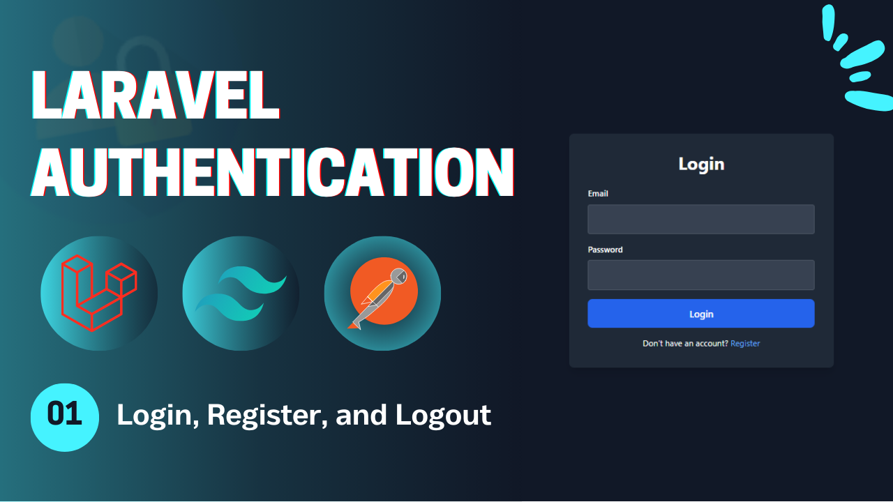
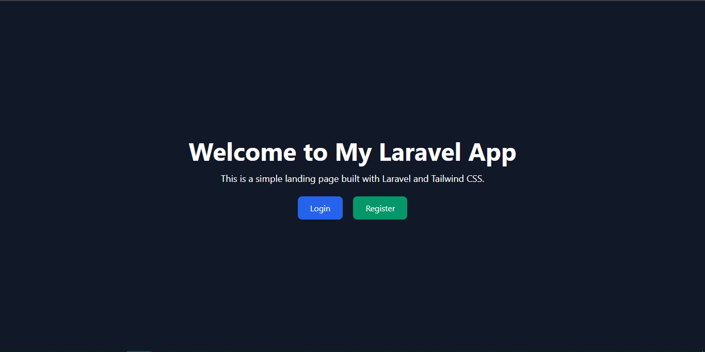
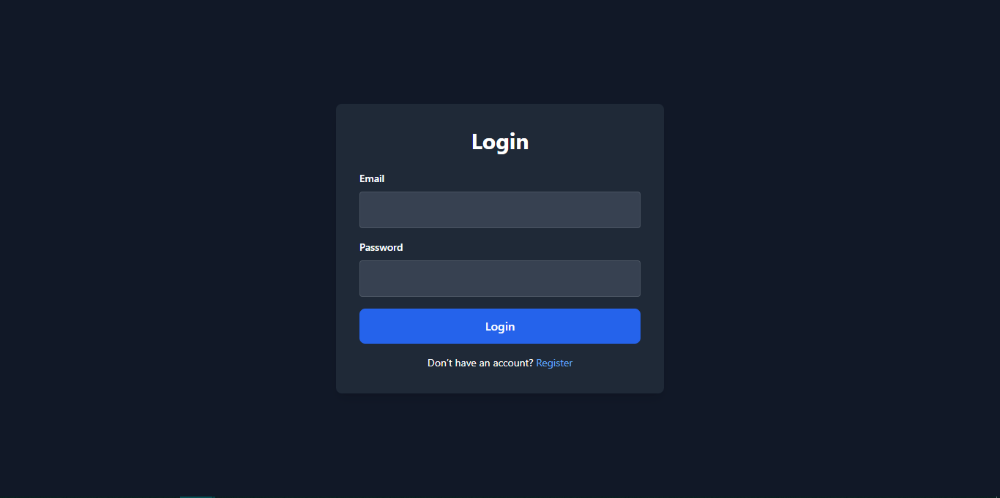
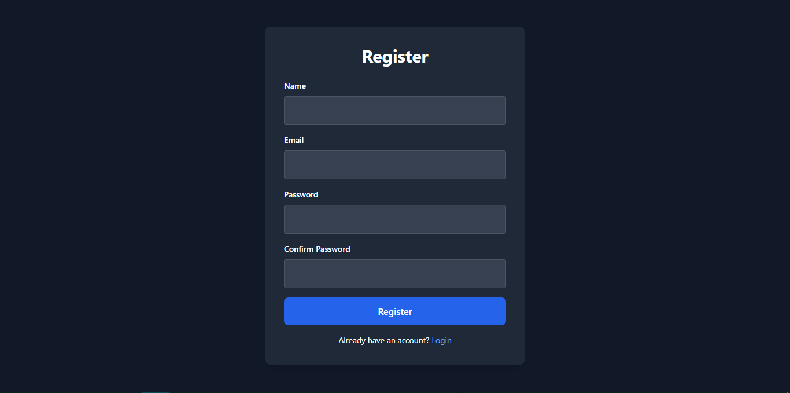
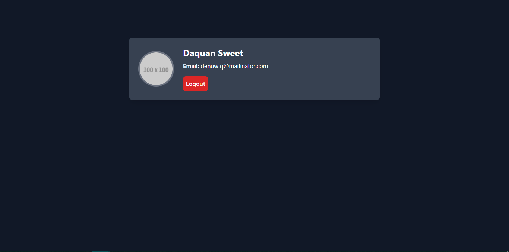

# Laravel Authentication - **Video 01: Login, Register, Logout** 🚀
  

## Overview 🌟

In this video, we implemented the foundational authentication features for a Laravel application, including:

- **Login** 🛠️  
- **Register** ✨  
- **Logout** 🔒  
- **Profile** 📑  
- Middleware-protected routes for authenticated users (Profile).  

This video introduces essential Laravel authentication concepts and lays the groundwork for more advanced features in the playlist.  

🎥 **Watch the full video here:** [01: Login, Register, Logout - Laravel Authentication](https://youtu.be/HXSkVzfjoSw)  

---

## UI Design 🎨

Here are the designs for the **Login**, **Register**, **Profile**, and **Home** pages:

1. **Home Page**  
     

2. **Login Page**  
     

3. **Register Page**  
     

4. **Profile Page**  
     

---

## Folder Structure 📁

Below is the folder structure relevant to this video:

```
📂 app
 ├── 📂 Http
 │    ├── 📂 Controllers
 │    │    ├── Auth
 │    │    │    ├── LoginController.php
 │    │    │    ├── RegisterController.php
 │    │    │    └── LogoutController.php
 │    └── 📂 Requests
 │         └── Auth
 │              ├── LoginRequest.php
 │              └── RegisterRequest.php
📂 resources
 └── 📂 views
      ├── 📂 auth
      │    ├── login.blade.php
      │    ├── register.blade.php
      │    └── profile.blade.php
      └── index.blade.php
📂 routes
 └── web.php
```

---

## Routes 🛤️

Here is a summary of the routes used in this video:

| **HTTP Method** | **Route**       | **Controller**        | **Auth**  | **Description**                   |
|-----------------|-----------------|-----------------------|-----------|-----------------------------------|
| `GET`           | `/`             | -                     | Guest     | Display the home page.            |
| `GET`           | `/login`        | -                     | Guest     | Display the login form.           |
| `GET`           | `/register`     | -                     | Guest     | Display the registration form.    |
| `POST`          | `/login`        | `LoginController`     | Guest     | Handle login submissions.         |
| `POST`          | `/register`     | `RegisterController`  | Guest     | Handle registration submissions.  |
| `POST`          | `/logout`       | `LogoutController`    | Auth      | Log out the user.                 |
| `GET`           | `/profile`      | -                     | Auth      | Display the profile page (auth).  |

---

## Implementation Details 🛠️

### **Controllers** 📄

#### `LoginController`  
Handles user login functionality using the `Auth::attempt()` method.

```php
class LoginController extends Controller {
    public function __invoke(LoginRequest $request) {
        if (Auth::attempt($request->only('email', 'password'))) {
            return redirect()->intended('/profile')->with('success', 'You are in');
        }
        return back()->with('error', 'Invalid credentials!');
    }
}
```

---

#### `RegisterController`  
Handles user registration and auto-login after account creation.

```php
class RegisterController extends Controller {
    public function __invoke(RegisterRequest $request) {
        $user = User::create([
            'name' => $request->name,
            'email' => $request->email,
            'password' => Hash::make($request->password)
        ]);

        Auth::login($user);
        return redirect()->to('/profile')->with('success', 'You have created your account successfully');
    }
}
```

---

#### `LogoutController`  
Handles user logout and redirects to the home page.

```php
class LogoutController extends Controller {
    public function __invoke(Request $request) {
        Auth::logout();
        return redirect()->to('/')->with('success', 'You are out');
    }
}
```

---

### **Validation Requests** ✅

#### `LoginRequest`  
Validates login form inputs.

```php
public function rules(): array {
    return [
        'email' => 'required|email|max:255',
        'password' => 'required|string|max:255'
    ];
}
```

---

#### `RegisterRequest`  
Validates registration form inputs.

```php
public function rules(): array {
    return [
        'name' => 'required|string|max:255',
        'email' => 'required|string|email|unique:users,email',
        'password' => 'required|string|min:6|confirmed'
    ];
}
```

---

## Key Features ✨

- **Route Structure**: Organized routes for login, register, and profile with middleware protection.  
- **Controller Design**: Clean and modular controller methods.  
- **Validation**: Centralized form validation using Laravel Request classes.  
- **Authentication**: User login and registration with session handling.  
- **Flash Messages**: User feedback for successful or failed actions.  

---

## How to Use 🚀

1. Clone the repository:  
   ```bash
   git clone https://github.com/Abdogoda/Laravel-Authentication.git
   cd Laravel-Authentication/01_login_register_logout
   ```

2. Install dependencies:  
   ```bash
   composer install
   ```

3. Set up configurations:  
   ```bash
   cp .env.example .env
   ```

4. Generate App Key
   ```bash
   php artisan key:generate
   ```

5. Set up the database (SQLITE):  
   ```bash
   php artisan migrate
   ```

6. Start the development server:  
   ```bash
   php artisan serve
   ```

7. Access the app in your browser at `http://localhost:8000`.

---

## Next Steps ▶️

In the next video, we'll expand on these features by editing the profile page.  
🎥 **Watch the full playlist here:** [Laravel Authentication](https://youtube.com/playlist?list=PLBy71Vfd0SzVaLjezaxqjnSsK8_p_aTcp&si=p3DluiMX7-euuw3A)  
