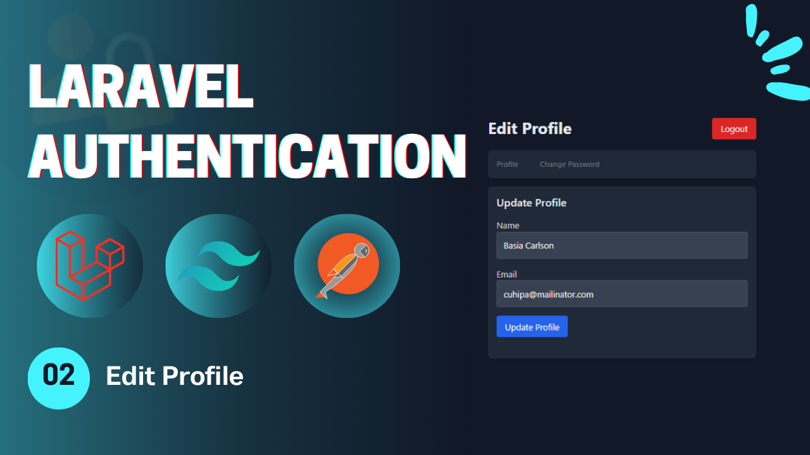
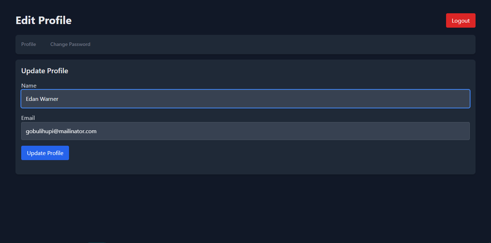
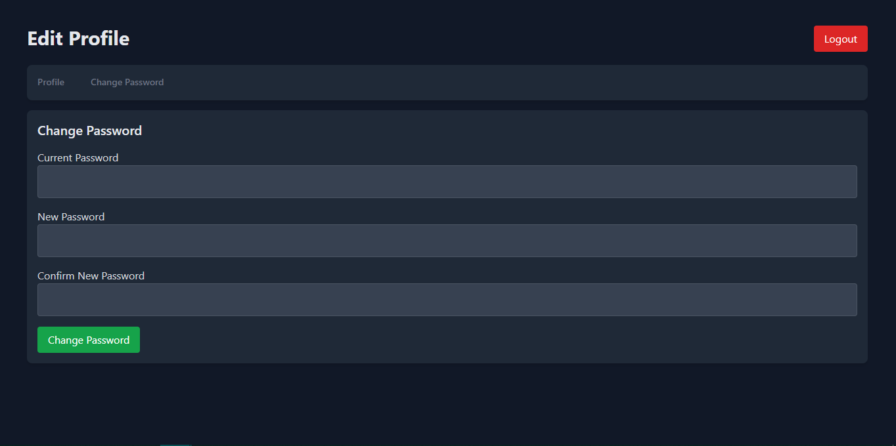

# Laravel Authentication - **Video 02: Edit Profile - Change Password** 📝
  

## Overview 🌟

In this video, we implemented the foundational authentication features for a Laravel application, including:

- **Edit Profile** 🛠️  
- **Change Password** 🔒  

This video introduces essential Laravel authentication concepts and lays the groundwork for more advanced features in the playlist.  

🎥 **Watch the full video here:** [02: Edit Profile, Change Password - Laravel Authentication](https://youtu.be/3jKLA8-SXSI)  

---

## UI Design 🎨

Here are the designs for the **Edit Profile** page:

1. **Edit Profile Page**  
   
   


---

## Folder Structure 📁

Below is the folder structure relevant to this video:

```
📂 app
 ├── 📂 Http
 │    ├── 📂 Controllers
 │    │    ├── Auth
 │    │    │    ├── LoginController.php
 │    │    │    ├── RegisterController.php
 │    │    │    ├── LogoutController.php
 │    │    │    ├── UpateProfileController.php
 │    │    │    └── ChangePasswordController.php
 │    └── 📂 Requests
 │         └── Auth
 │              ├── LoginRequest.php
 │              ├── RegisterRequest.php
 │              ├── UpdateProfileRequest.php
 │              └── ChangePasswordRequest.php
📂 resources
 └── 📂 views
      ├── 📂 auth
      │    ├── login.blade.php
      │    ├── register.blade.php
      │    └── profile.blade.php
      └── index.blade.php
📂 routes
 └── web.php
```

---

## Routes 🛤️

Here is a summary of the routes used in this video:

| **HTTP Method** | **Route**          | **Controller**             | **Auth**  | **Description**                   |
|-----------------|--------------------|----------------------------|-----------|-----------------------------------|
| `GET`           | `/`                | -                          | Guest     | Display the home page.            |
| `GET`           | `/login`           | -                          | Guest     | Display the login form.           |
| `GET`           | `/register`        | -                          | Guest     | Display the registration form.    |
| `POST`          | `/login`           | `LoginController`          | Guest     | Handle login submissions.         |
| `POST`          | `/register`        | `RegisterController`       | Guest     | Handle registration submissions.  |
| `POST`          | `/logout`          | `LogoutController`         | Auth      | Log out the user.                 |
| `GET`           | `/profile`         | -                          | Auth      | Display the profile page (auth).  |
| `PUT`           | `/profile`         | `UpdateProfileController`  | Auth      | Update the profile info (auth).   |
| `POST`          | `/change-password` | `ChangePasswordController` | Auth      | Change the user password (auth).  |

---

## Implementation Details 🛠️

### **Controllers** 📄

#### `UpdateProfileController`  
Handles update user information functionality using the `$user->update()` method.

```php
class UpdateProfileController extends Controller {
    public function __invoke(UpdateProfileReqeust $request){
        $user = User::find(Auth::id());
        $user->update($request->validated());

        return back()->with('success', 'Profile updated successfully');
    }
}
```

---

#### `ChangePasswordController`  
Handles change user password with a new one.

```php
class ChangePasswordController extends Controller {
    public function __invoke(ChangePasswordReqeust $request){
        $user = User::find(Auth::id());
        if(!Hash::check($request->current_password, $user->password)){
            return back()->with('error', 'Current password incorrect!');
        }

        $user->update(['password' => Hash::make($request->new_password)]);
        return back()->with('success', 'Your password changed successfully!');
    }
}
```

---

### **Validation Requests** ✅

#### `UpdateProfileRequest`  
Validates updating profile form inputs.

```php
public function rules(): array{
    $id = Auth::id();
    return [
        'name' => 'required|string|max:255',
        'email' => 'required|string|email|unique:users,email,'.$id,
    ];
}
```

---

#### `ChangePasswordRequest`  
Validates changing password form inputs.

```php
public function rules(): array{
    return [
        'current_password' => 'required|string',
        'new_password' => 'required|string|min:6|confirmed'
    ];
}
```

---

## Key Features ✨

- **Route Structure**: Organized routes for update profile, and change password with middleware protection.  
- **Controller Design**: Clean and modular controller methods.  
- **Validation**: Centralized form validation using Laravel Request classes.  
- **Flash Messages**: User feedback for successful or failed actions.  

---

## How to Use 🚀

1. Clone the repository:  
   ```bash
   git clone https://github.com/Abdogoda/Laravel-Authentication.git
   cd Laravel-Authentication/02_edit_profile
   ```

2. Install dependencies:  
   ```bash
   composer install
   ```

3. Set up configurations:  
   ```bash
   cp .env.example .env
   ```

4. Generate App Key
   ```bash
   php artisan key:generate
   ```

5. Set up the database (SQLITE):  
   ```bash
   php artisan migrate
   ```

6. Start the development server:  
   ```bash
   php artisan serve
   ```

7. Access the app in your browser at `http://localhost:8000`.

---

## Next Steps ▶️

In the next video, we'll expand on these features by resetting the password functionality.  
🎥 **Watch the full playlist here:** [Laravel Authentication](https://youtube.com/playlist?list=PLBy71Vfd0SzVaLjezaxqjnSsK8_p_aTcp&si=p3DluiMX7-euuw3A)  
