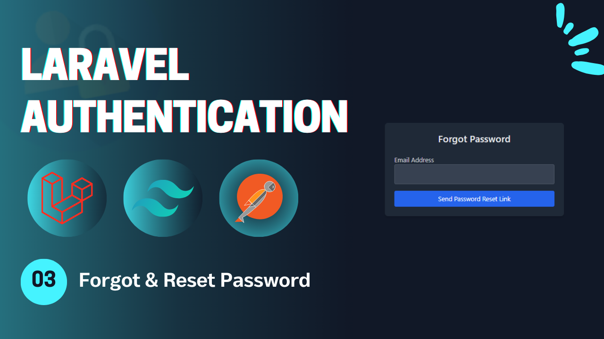
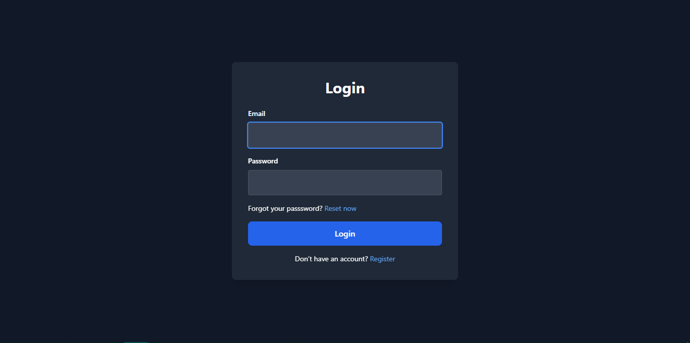
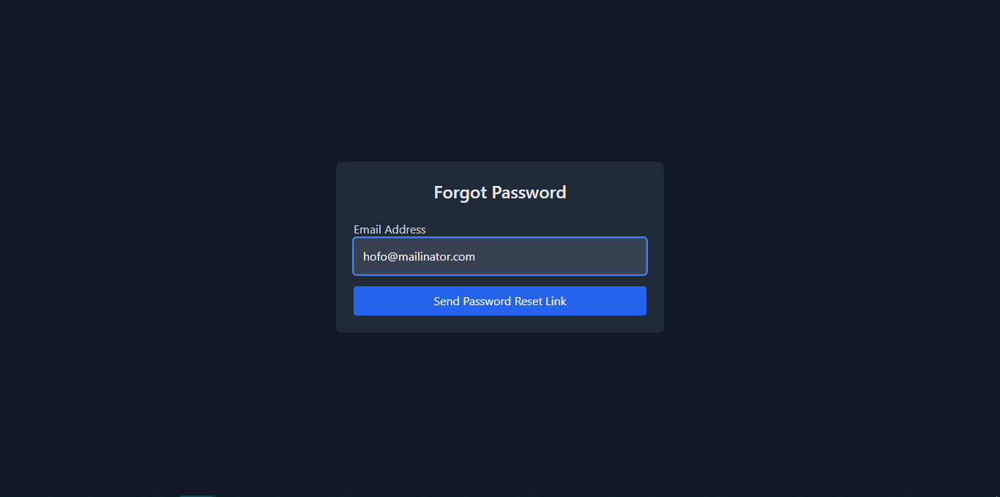
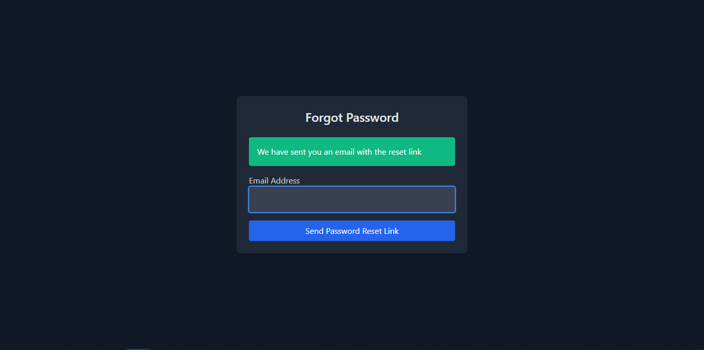
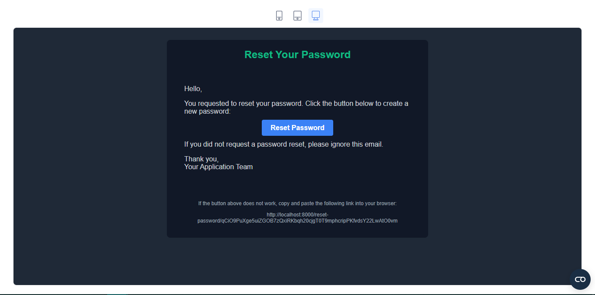

# Laravel Authentication - **Video 03: Reset Password** 🔑
  

## Overview 🌟

In this video, we implemented password reset functionality for a Laravel application, including:

- **Forgot Password** 🛠️  
- **Reset Password** 🔄  
- **Sending Reset Link via Email** 📧  

This video covers the essential steps to enable users to recover their passwords and securely update them.

🎥 **Watch the full video here:** [03: Reset Password - Laravel Authentication](<insert-video-link-here>)  

---

## UI Design 🎨

Here are the designs for the **Forgot Password**, **Reset Password**, and **Email** pages:

1. **Login Page**  
    

2. **Forgot Password Page**  
    

3. **Reset Password Page**  
    

4. **Email Page**  
    

---

## Folder Structure 📁

Below is the folder structure relevant to this video:

```
📂 app
 ├── 📂 Http
 │    ├── 📂 Controllers
 │    │    └── Auth
 │    │         ├── LoginController.php
 │    │         ├── RegisterController.php
 │    │         ├── LogoutController.php
 │    │         ├── UpateProfileController.php
 │    │         ├── ChangePasswordController.php
 │    │         ├── ForgotPasswordController.php
 │    │         └── ResetPasswordController.php
 │    └── 📂 Requests
 │         └── Auth
 |              ├── LoginRequest.php
 │              ├── RegisterRequest.php
 │              ├── UpdateProfileRequest.php
 │              ├── ChangePasswordRequest.php
 │              ├── ForgotPasswordRequest.php
 │              └── ResetPasswordRequest.php
 ├── 📂 Models
 │    └── User.php
 └── 📂 Mail
      └── SendResetLinkMail.php
📂 resources
 └── 📂 views
      ├── 📂 auth
      │    ├── login.blade.php
      │    ├── register.blade.php
      │    ├── forgot-password.blade.php
      │    ├── reset-password.blade.php
      │    └── profile.blade.php
      ├── 📂 emails
      │    └── reset-password.blade.php
      └── index.blade.php
📂 routes
    └── web.php
```

---

## Routes 🛤️

Here is a summary of the routes used in this video:

| **HTTP Method** | **Route**                 | **Controller**              | **Auth**  | **Description**                        |
|-----------------|---------------------------|-----------------------------|-----------|----------------------------------------|
| `GET`           | `/`                       | -                           | Guest     | Display the home page.                 |
| `GET`           | `/login`                  | -                           | Guest     | Display the login form.                |
| `GET`           | `/register`               | -                           | Guest     | Display the registration form.         |
| `POST`          | `/login`                  | `LoginController`           | Guest     | Handle login submissions.              |
| `POST`          | `/register`               | `RegisterController`        | Guest     | Handle registration submissions.       |
| `GET`           | `/forgot-password`        | -                           | Guest     | Display the forgot password form.      |
| `GET`           | `/reset-password/{token}` | -                           | Guest     | Display the reset password form.       |
| `POST`          | `/forgot-password`        | `ForgotPasswordController`  | Guest     | Handle forgot password submission.     |
| `POST`          | `/reset-password`         | `ResetPasswordController`   | Guest     | Handle password reset submission.      |
| `POST`          | `/logout`                 | `LogoutController`          | Auth      | Log out the user.                      |
| `GET`           | `/profile`                | -                           | Auth      | Display the profile page (auth).       |
| `PUT`           | `/profile`                | `UpdateProfileController`   | Auth      | Update the profile info (auth).        |
| `POST`          | `/change-password`        | `ChangePasswordController`  | Auth      | Change the user password (auth).       |

---

## Implementation Details 🛠️

### **Controllers** 📄

#### `ForgotPasswordController`  
Handles the request for sending a password reset link to the user’s email.

```php
class ForgotPasswordController extends Controller {
    public function __invoke(ForgotPasswordRequest $request) {
        $token = Str::random(60);

        DB::table('password_reset_tokens')->updateOrInsert(
            ['email' => $request->email],
            ['token' => $token, 'created_at' => now()]
        );

        Mail::to($request->email)->send(new SendResetLinkMail($token));

        return back()->with("success", 'We have sent you an email with the reset link');
    }
}
```

---

#### `ResetPasswordController`  
Handles the password reset process using the provided token.

```php
class ResetPasswordController extends Controller {
    public function __invoke(ResetPasswordRequest $request) {
        $result = DB::table('password_reset_tokens')
            ->where('email', $request->email)
            ->where('token', $request->token)
            ->first();
        
        if(!$result){
            return back()->with('error', 'Invalid Token or email address');
        }

        DB::table('password_reset_tokens')
            ->where('email', $request->email)
            ->delete();

        $user = User::where('email', $request->email)->first();
        $user->update(['password' => Hash::make($request->password)]);

        return redirect()->to("/login")->with("success", 'Password reset successfully, you can login now');
    }
}
```

---

### **Validation Requests** ✅

#### `ForgotPasswordRequest`  
Validates the email address provided by the user.

```php
public function rules(): array {
    return [
        'email' => 'required|string|email|exists:users,email'
    ];
}
```

---

#### `ResetPasswordRequest`  
Validates the token, email, and password for the reset request.

```php
public function rules(): array {
    return [
        'token' => 'required|string',
        'email' => 'required|string|email|exists:users,email',
        'password' => 'required|min:6|string|confirmed'
    ];
}
```

---

### **Mail Class** 📧

#### `SendResetLinkMail`  
Handles sending the password reset link via email.

```php
class SendResetLinkMail extends Mailable {
    use Queueable, SerializesModels;

    public $resetUrl;

    public function __construct(string $token) {
        $this->resetUrl = url('reset-password/'.$token);
    }

    public function envelope(): Envelope {
        return new Envelope(subject: 'Send Reset Link Mail');
    }

    public function content(): Content {
        return new Content(view: 'emails.reset-password');
    }

    public function attachments(): array {
        return [];
    }
}
```

---

## Key Features ✨

- **Password Reset Flow**: Forgot password form and reset password functionality with email verification.  
- **Controller Design**: Modular controllers to handle the password reset process.  
- **Email Integration**: Email is sent with a link to reset the password securely.  
- **Validation**: Centralized form validation using Laravel Request classes.  
- **Flash Messages**: User feedback for successful or failed password reset actions.  

---

## How to Use 🚀

1. Clone the repository:  
   ```bash
   git clone https://github.com/Abdogoda/Laravel-Authentication.git
   cd Laravel-Authentication/03_reset_password
   ```

2. Install dependencies:  
   ```bash
   composer install
   ```

3. Set up configurations:  
   ```bash
   cp .env.example .env
   ```

4. Generate App Key
   ```bash
   php artisan key:generate
   ```

5. Set up the database (SQLITE):  
   ```bash
   php artisan migrate
   ```

6. Start the development server:  
   ```bash
   php artisan serve
   ```

7. Access the app in your browser at `http://localhost:8000`.

---

## Next Steps ▶️

In the next video, we'll expand on these features by adding email verification with otp.  
🎥 **Watch the full playlist here:** [Laravel Authentication](https://youtube.com/playlist?list=PLBy71Vfd0SzVaLjezaxqjnSsK8_p_aTcp&si=p3DluiMX7-euuw3A)  
