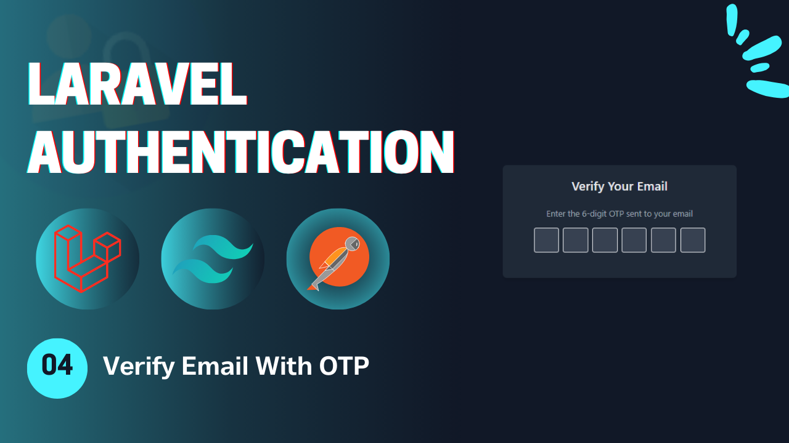
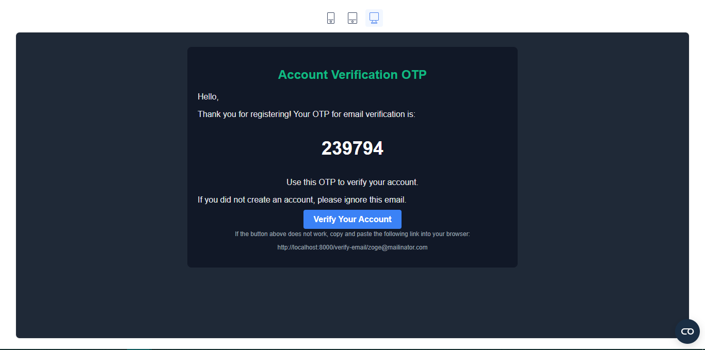
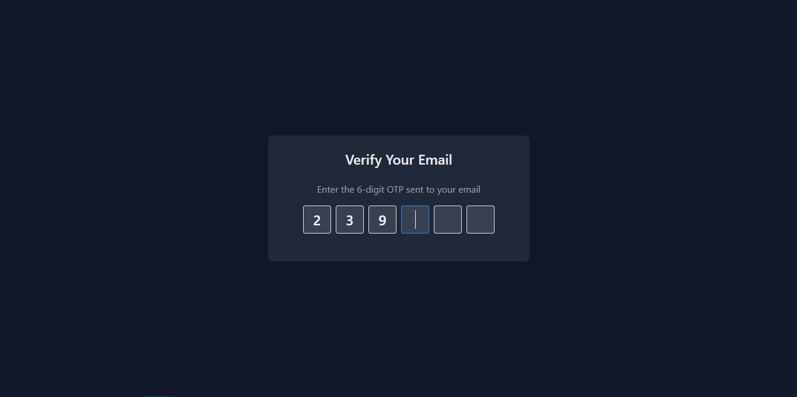
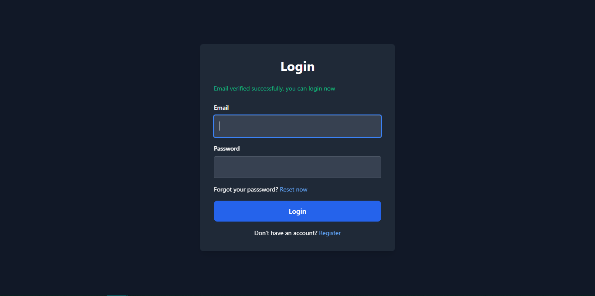

# Laravel Authentication - **Video 04: Email Verification** 📧
  

## Overview 🌟

In this video, we focus on the **Email Verification** process for a Laravel application. Specifically, we implement:

- **Email Verification with OTP** 🔒  
- **Resending OTP** 🔄  
- **Verifying User's Email** ✅

The goal is to ensure users verify their email addresses before proceeding with any further actions in your application.

🎥 **Watch the full video here:** [04: Email Verification - Laravel Authentication](https://youtu.be/nf88CiWR8HE)

---

## UI Design 🎨

Here are the designs related to the **Email Verification** page:

- **Email Verification Mail**  
    
    
- **Email Verification Page**  
    

- **Login Page**  
    

---

## Folder Structure 📁

Here is the folder structure for the relevant parts of the **Email Verification** process:

```
📂 app
 ├── 📂 Http
 │    ├── 📂 Controllers
 │    │    └── Auth
 │    │        ├── LoginController.php
 │    │        ├── RegisterController.php
 │    │        ├── LogoutController.php
 │    │        ├── UpateProfileController.php
 │    │        ├── ChangePasswordController.php
 │    │        ├── ForgotPasswordController.php
 │    │        ├── ResetPasswordController.php
 │    │        └── VerifyAccountController.php
 │    └── 📂 Requests
 │         └── Auth
 |              ├── LoginRequest.php
 │              ├── RegisterRequest.php
 │              ├── UpdateProfileRequest.php
 │              ├── ChangePasswordRequest.php
 │              ├── ForgotPasswordRequest.php
 │              ├── ResetPasswordRequest.php
 │              └── VerifyAccountRequest.php
 ├── 📂 Models
 │    └── User.php
 └── 📂 Mail
      ├── SendResetLinkMail.php
      └── VerifyAccountMail.php
📂 resources
 └── 📂 views
      ├── 📂 auth
      |    ├── login.blade.php
      │    ├── register.blade.php
      │    ├── forgot-password.blade.php
      │    ├── reset-password.blade.php
      │    ├── profile.blade.php
      │    └── verify-email.blade.php
      ├── 📂 emails
      │    ├── reset-password.blade.php
      │    └── verify-account.blade.php
      └── index.blade.php
📂 routes
 └── web.php
```

---

## Routes 🛤️

Below is the list of all relevant routes, including the **Email Verification** route:

| **HTTP Method** | **Route**                 | **Controller**              | **Auth**  | **Description**                        |
|-----------------|---------------------------|-----------------------------|-----------|----------------------------------------|
| `GET`           | `/login`                  | -                           | Guest     | Display the login form.                |
| `GET`           | `/register`               | -                           | Guest     | Display the registration form.         |
| `POST`          | `/login`                  | `LoginController`           | Guest     | Handle login submissions.              |
| `POST`          | `/register`               | `RegisterController`        | Guest     | Handle registration submissions.       |
| `GET`           | `/verify-email/{email}`   | `VerifyAccountController`   | Guest     | Display the email verification form.   |
| `POST`          | `/verify-email`           | `VerifyAccountController`   | Guest     | Handle email verification.             |
| `GET`           | `/forgot-password`        | -                           | Guest     | Display the forgot password form.      |
| `GET`           | `/reset-password/{token}` | -                           | Guest     | Display the reset password form.       |
| `POST`          | `/forgot-password`        | `ForgotPasswordController`  | Guest     | Handle forgot password submission.     |
| `POST`          | `/reset-password`         | `ResetPasswordController`   | Guest     | Handle password reset submission.      |
| `POST`          | `/logout`                 | `LogoutController`          | Auth      | Log out the user.                      |
| `GET`           | `/profile`                | -                           | Auth      | Display the profile page (auth).       |
| `PUT`           | `/profile`                | `UpdateProfileController`   | Auth      | Update the profile info (auth).        |
| `POST`          | `/change-password`        | `ChangePasswordController`  | Auth      | Change the user password (auth).       |

---

## Implementation Details 🛠️

### **Migrations** 📅
#### `add_otp_to_users_table`
Make a migration to add the otp attribute to the `users` table.
```php
Schema::table('users', function (Blueprint $table) {
  $table->string('otp')->nullable();
});
```

---

### **Controllers** 📄

#### `VerifyAccountController`

The **VerifyAccountController** handles the email verification logic. When the user accesses the verification page, this controller retrieves the email from the route parameter and presents the form for the OTP.

```php
class VerifyAccountController extends Controller {
  public function __invoke(VerifyAccountRequest $request){
    $user = User::where('email', $request->email)->first();
    if($user->otp != implode("", $request->otp)){
      return back()->with('error', 'Invalid OTP or email address');
    }

    $user->email_verified_at = now();
    $user->save();

    return redirect()->route("login")->with('success', 'Email verified successfully, you can login now');
  }
}
```

#### `RegisterController`

The **RegisterController** add OTP to the user record in the database, and then send the verify account mail to this user with this OTP to be verified.

```php
class RegisterController extends Controller{
  public function __invoke(RegisterRequest $request){
    $user = User::create([
      'name' => $request->name,
      'email' => $request->email,
      'password' => Hash::make($request->password),
      'otp' => rand(100000, 999999)
    ]);

    Mail::to($user->email)->send(new VerifyAccountMail($user->otp, $user->email));

    return redirect()->route('email.verify', $user->email);
  }
}
```

#### `LoginController`

The **LoginController** verfiy that the user account is verified or not, if not verified send an OTP to the user's email, and if verified login.

```php
class LoginController extends Controller{
  public function __invoke(LoginRequest $request){
    $user = User::where('email', $request->email)->first();

    if(!$user || !Hash::check($request->password, $user->password)){
      return back()->with('error', 'Invalid credentials!');
    }

    if(!$user->email_verified_at){
      Mail::to($user->email)->send(new VerifyAccountMail($user->otp, $user->email));
      return redirect()->route('email.verify', $user->email);
    }

    Auth::login($user);
    return redirect()->intended('/profile')->with('success', 'You are in');
  }
}
```

---

### **Request Validation: `VerifyAccountRequest`**

The `VerifyAccountRequest` validates the input provided for the email verification form. It ensures that the OTP and email fields are correct.

```php
class VerifyAccountRequest extends FormRequest {
    public function rules() {
        return [
            'email' => 'required|email|exists:users,email',
            'otp' => 'required|numeric|digits:6',
        ];
    }
}
```

---

### **Mail Class** 📧
#### `VerifyAccountMail`

The **VerifyAccountMail** sends the OTP email to the user upon registration.

```php
class VerifyAccountMail extends Mailable {
    use Queueable, SerializesModels;

    public $otp, $verifyUrl;

    public function __construct($otp, $email) {
        $this->otp = $otp;
        $this->verifyUrl = route('verify-email', ['email' => $email]);
    }

    public function build() {
        return $this->subject('Verify Your Email Address')
                    ->view('emails.verify-account');
    }
}
```
---


## Key Features ✨

- **Verify Email Flow**: Verify email functionality.  
- **Controller Design**: Modular controllers to handle the verifing email process.  
- **Email Integration**: Email is sent with a verify account securely.  
- **Validation**: Centralized form validation using Laravel Request classes.  
- **Flash Messages**: User feedback for successful or failed actions.  

---

## How to Use 🚀

1. Clone the repository:  
   ```bash
   git clone https://github.com/Abdogoda/Laravel-Authentication.git
   cd Laravel-Authentication/04_verify_email_with_otp
   ```

2. Install dependencies:  
   ```bash
   composer install
   ```

3. Set up configurations:  
   ```bash
   cp .env.example .env
   ```

4. Generate App Key
   ```bash
   php artisan key:generate
   ```

5. Set up the database (SQLITE):  
   ```bash
   php artisan migrate
   ```

6. Start the development server:  
   ```bash
   php artisan serve
   ```

7. Access the app in your browser at `http://localhost:8000`.

---

## Next Steps ▶️

Once the email is verified, users will be able to log in. In the next video, we will focus on the **Socialist Authentication** functionality specificly with Google.

🎥 **Watch the full playlist here:** [Laravel Authentication](https://youtube.com/playlist?list=PLBy71Vfd0SzVaLjezaxqjnSsK8_p_aTcp&si=p3DluiMX7-euuw3A)
