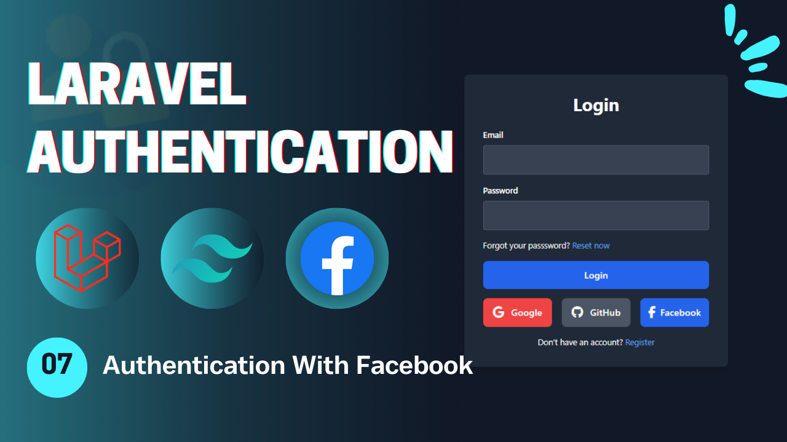

# Laravel Authentication - **Video 07: Authentication With Facebook**
  

## Overview 🌟

In this video, we focus on the **Authentication With Facebook** process for a Laravel application. Specifically, we implement:

- **Login With Facebook** 🔒  
- **Register With Facebook** 👤  

The goal is to ensure that users can login and register with their Facebook accounts to provide more realism to your application.

🎥 **Watch the full video here:** [07: Authentication With Facebook - Laravel Authentication](https://youtu.be/wNDffxKnmEY)

---

## UI Design 🎨

Here are the designs related to the **Authentication With Facebook**:

- **Login Page**  
    

---

## Folder Structure 📁

Here is the folder structure for the relevant parts of the **Authentication With Facebook** process:

```
📂 app
 ├── 📂 Http
 │    ├── 📂 Controllers
 │    │    └── Auth
 │    │        ├── LoginController.php
 │    │        ├── RegisterController.php
 │    │        ├── LogoutController.php
 │    │        ├── UpateProfileController.php
 │    │        ├── ChangePasswordController.php
 │    │        ├── ForgotPasswordController.php
 │    │        ├── ResetPasswordController.php
 │    │        ├── VerifyAccountController.php
 │    │        ├── GoogleAuthController.php
 │    │        ├── GithubAuthController.php
 │    │        └── FacebookAuthController.php
 │    └── 📂 Requests
 │         └── Auth
 |              ├── LoginRequest.php
 │              ├── RegisterRequest.php
 │              ├── UpdateProfileRequest.php
 │              ├── ChangePasswordRequest.php
 │              ├── ForgotPasswordRequest.php
 │              ├── ResetPasswordRequest.php
 │              └── VerifyAccountRequest.php
 ├── 📂 Models
 │    └── User.php
 └── 📂 Mail
      ├── SendResetLinkMail.php
      └── VerifyAccountMail.php
📂 resources
 └── 📂 views
      ├── 📂 auth
      |    ├── login.blade.php
      │    ├── register.blade.php
      │    ├── forgot-password.blade.php
      │    ├── reset-password.blade.php
      │    ├── profile.blade.php
      │    └── verify-email.blade.php
      ├── 📂 emails
      │    ├── reset-password.blade.php
      │    └── verify-account.blade.php
      └── index.blade.php
📂 routes
 └── web.php
```

---

## Routes 🛤️

Below is the list of all relevant routes, including the **Email Verification** route:

| **HTTP Method** | **Route**                 | **Controller**              | **Auth**  | **Description**                          |
|-----------------|---------------------------|-----------------------------|-----------|------------------------------------------|
| `GET`           | `/login`                  | -                           | Guest     | Display the login form.                  |
| `GET`           | `/register`               | -                           | Guest     | Display the registration form.           |
| `POST`          | `/login`                  | `LoginController`           | Guest     | Handle login submissions.                |
| `POST`          | `/register`               | `RegisterController`        | Guest     | Handle registration submissions.         |
| `GET`           | `/verify-email/{email}`   | `VerifyAccountController`   | Guest     | Display the email verification form.     |
| `POST`          | `/verify-email`           | `VerifyAccountController`   | Guest     | Handle email verification.               |
| `GET`           | `/forgot-password`        | -                           | Guest     | Display the forgot password form.        |
| `GET`           | `/reset-password/{token}` | -                           | Guest     | Display the reset password form.         |
| `POST`          | `/forgot-password`        | `ForgotPasswordController`  | Guest     | Handle forgot password submission.       |
| `POST`          | `/reset-password`         | `ResetPasswordController`   | Guest     | Handle password reset submission.        |
| `GET`           | `/auth/google/redirect`   | `GoogleAuthController`      | Guest     | Redirect to google service to login.     |
| `GET`           | `/auth/google/callback`   | `GoogleAuthController`      | Guest     | Callback from google to perform login.   |
| `GET`           | `/auth/github/redirect`   | `GithubAuthController`      | Guest     | Redirect to github service to login.     |
| `GET`           | `/auth/github/callback`   | `GithubAuthController`      | Guest     | Callback from github to perform login.   |
| `GET`           | `/auth/facebook/redirect` | `FacebookAuthController`    | Guest     | Redirect to facebook service to login.   |
| `GET`           | `/auth/facebook/callback` | `FacebookAuthController`    | Guest     | Callback from facebook to perform login. |
| `POST`          | `/logout`                 | `LogoutController`          | Auth      | Log out the user.                        |
| `GET`           | `/profile`                | -                           | Auth      | Display the profile page (auth).         |
| `PUT`           | `/profile`                | `UpdateProfileController`   | Auth      | Update the profile info (auth).          |
| `POST`          | `/change-password`        | `ChangePasswordController`  | Auth      | Change the user password (auth).         |

---

## Implementation Details 🛠️

### **Controllers** 📄

#### `FacebookAuthController`

The **FacebookAuthController** handles the redirection to Facebook service in order to login to Facebook or choose an account to perform authentication with. When the user click on *Authentication with Facebook*, it redirect him to the Facebook service to choose his account then it return back to the application as a *CALLBACK* to verify this account in order to Login or Create a new account for this user account using ***firstOrCreate*** method.

```php
class FacebookAuthController extends Controller{
  public function redirect(){
    return Socialite::driver('facebook')->redirect();
  }
  
  public function callback(){
    $facebookUser = Socialite::driver('facebook')->user();

    $user = User::firstOrCreate(
      ['email' => $facebookUser->getEmail()],
      [
        'name' => $facebookUser->getName(),
        'password' => Hash::make(Str::random(14)),
        'email_verified_at' => now(),
        'otp' => rand(100000, 999999)
      ]
    );

    Auth::login($user);
    return redirect()->intended('/profile')->with('success', 'You are in');
  }
}
```

---

### **Social Services Configuration: `services.php`**

The `services.php` used to register the configurations related to the facebook service in order to use it in the application.

```php
[
  'facebook' => [
    'client_id' => env('FACEBOOK_CLIENT_ID'),
    'client_secret' => env('FACEBOOK_CLIENT_SECRET'),
    'redirect' => env("FACEBOOK_CALLBACK_URL"),
  ],
]
```
---


## Key Features ✨

- **Facebook Authentication Flow**: Login or Register functionality.  
- **Controller Design**: Modular controllers to handle the authentication process process.  
- **Flash Messages**: User feedback for successful or failed actions.  

---

## How to Use 🚀

1. Clone the repository:  
   ```bash
   git clone https://github.com/Abdogoda/Laravel-Authentication.git
   cd Laravel-Authentication/07_auth_with_facebook
   ```

2. Install dependencies:  
   ```bash
   composer install
   ```

3. Set up configurations:  
   ```bash
   cp .env.example .env
   ```
   Add the facebook service configurations in the *.env* file:
   ```bash
    FACEBOOK_CLIENT_ID=
    FACEBOOK_CLIENT_SECRET=
    FACEBOOK_CALLBACK_URL=
   ```


4. Generate App Key
   ```bash
   php artisan key:generate
   ```

5. Set up the database (SQLITE):  
   ```bash
   php artisan migrate
   ```

6. Start the development server:  
   ```bash
   php artisan serve
   ```

7. Access the app in your browser at `http://localhost:8000`.

---

## Next Steps ▶️

As we complete our Socialite authentication series, this video covers Authentication with Facebook. In the next installment, we will explore **Enhance Social Authentication** by making it general and reusable to further expand our social login options.

🎥 **Watch the full playlist here:** [Laravel Authentication](https://youtube.com/playlist?list=PLBy71Vfd0SzVaLjezaxqjnSsK8_p_aTcp&si=p3DluiMX7-euuw3A)
