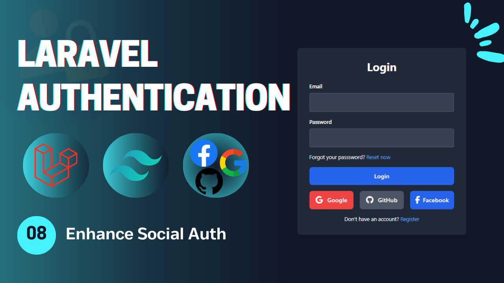
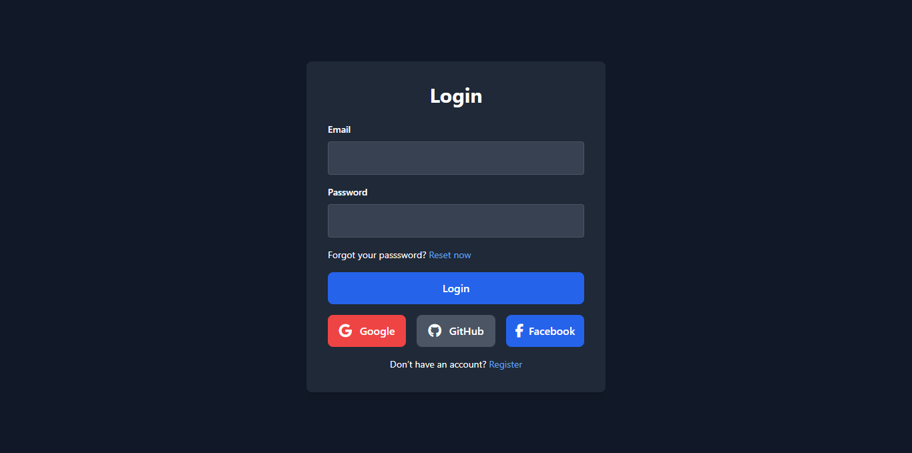

# Laravel Authentication - **Video 08: Enhance Social Authentication**
  

## Overview 🌟

In this video, we focus on the **Enhance Social Authentication** process for a Laravel application. Specifically, we implement:

- **Login With Social Service** 🔒  
- **Register With Social Service** 👤  

The goal is to ensure making social authentication general and reusable to further expand our social login options to provide more realism to your application.

🎥 **Watch the full video here:** [08: Enhance Social Authentication - Laravel Authentication](https://youtu.be/dzj2BaPBeSA)

---

## UI Design 🎨

Here are the designs related to the **Enhance Social Authentication**:

- **Login Page**  
    

---

## Folder Structure 📁

Here is the folder structure for the relevant parts of the **Enhance Social Authentication** process:

```
📂 app
 ├── 📂 Http
 │    ├── 📂 Controllers
 │    │    └── Auth
 │    │        ├── LoginController.php
 │    │        ├── RegisterController.php
 │    │        ├── LogoutController.php
 │    │        ├── UpateProfileController.php
 │    │        ├── ChangePasswordController.php
 │    │        ├── ForgotPasswordController.php
 │    │        ├── ResetPasswordController.php
 │    │        ├── VerifyAccountController.php
 │    │        └── SocialAuthController.php
 │    └── 📂 Requests
 │         └── Auth
 |              ├── LoginRequest.php
 │              ├── RegisterRequest.php
 │              ├── UpdateProfileRequest.php
 │              ├── ChangePasswordRequest.php
 │              ├── ForgotPasswordRequest.php
 │              ├── ResetPasswordRequest.php
 │              └── VerifyAccountRequest.php
 └── 📂 Mail
      ├── SendResetLinkMail.php
      └── VerifyAccountMail.php
📂 resources
 └── 📂 views
      ├── 📂 auth
      |    ├── login.blade.php
      │    ├── register.blade.php
      │    ├── forgot-password.blade.php
      │    ├── reset-password.blade.php
      │    ├── profile.blade.php
      │    └── verify-email.blade.php
      ├── 📂 emails
      │    ├── reset-password.blade.php
      │    └── verify-account.blade.php
      └── index.blade.php
📂 routes
 └── web.php
```

---

## Routes 🛤️

Below is the list of all relevant routes, including the **Email Verification** route:

| **HTTP Method** | **Route**                    | **Controller**              | **Auth**  | **Description**                          |
|-----------------|------------------------------|-----------------------------|-----------|------------------------------------------|
| `GET`           | `/login`                     | -                           | Guest     | Display the login form.                  |
| `GET`           | `/register`                  | -                           | Guest     | Display the registration form.           |
| `POST`          | `/login`                     | `LoginController`           | Guest     | Handle login submissions.                |
| `POST`          | `/register`                  | `RegisterController`        | Guest     | Handle registration submissions.         |
| `GET`           | `/verify-email/{email}`      | `VerifyAccountController`   | Guest     | Display the email verification form.     |
| `POST`          | `/verify-email`              | `VerifyAccountController`   | Guest     | Handle email verification.               |
| `GET`           | `/forgot-password`           | -                           | Guest     | Display the forgot password form.        |
| `GET`           | `/reset-password/{token}`    | -                           | Guest     | Display the reset password form.         |
| `POST`          | `/forgot-password`           | `ForgotPasswordController`  | Guest     | Handle forgot password submission.       |
| `POST`          | `/reset-password`            | `ResetPasswordController`   | Guest     | Handle password reset submission.        |
| `GET`           | `/auth/{driver}/redirect`    | `SocialAuthController`      | Guest     | Redirect to social service to login.     |
| `GET`           | `/auth/{driver}/callback`    | `SocialAuthController`      | Guest     | Callback from social to perform login.   |
| `POST`          | `/logout`                    | `LogoutController`          | Auth      | Log out the user.                        |
| `GET`           | `/profile`                   | -                           | Auth      | Display the profile page (auth).         |
| `PUT`           | `/profile`                   | `UpdateProfileController`   | Auth      | Update the profile info (auth).          |
| `POST`          | `/change-password`           | `ChangePasswordController`  | Auth      | Change the user password (auth).         |

---

## Implementation Details 🛠️

### **Controllers** 📄

#### `SocailAuthController`

The **SocailAuthController** handles the redirection to the social service in order to login to the social or choose an account to perform authentication with. This is an alternative way to make the social authentication general and reusable. When the user chooses any social service, it return back to the application as a *CALLBACK* to verify this account in order to Login or Create a new account for this user account using ***firstOrCreate*** method.

```php
class SocailAuthController extends Controller{

  public function redirect(string $driver){
    if(!array_key_exists($driver, config('social.providers'))){
      return redirect()->to('login')->with('error', 'Invalid Driver');
    }
    return Socialite::driver($driver)->redirect();
  }

  public function callback(string $driver){
    if(!array_key_exists($driver, config('social.providers'))){
      return redirect()->to('login')->with('error', 'Invalid Driver');
    }
    
    try {
      $socialUser = Socialite::driver($driver)->user();
    } catch (\Exception $e) {
      return redirect()->to('login')->with('error', 'Authentication Failed');
    }

    $user = User::firstOrCreate(
      ['email' => $socialUser->getEmail()],
      [
        'name' => $socialUser->getName(),
        'password' => Hash::make(Str::random(14)),
        'email_verified_at' => now(),
        'otp' => random_int(100000, 999999)
      ]
    );

    Auth::login($user);
    return redirect()->intended('/profile')->with('success', 'You are in');
  }
}
```

---

### **Social Services Configuration: `social.php`**

The `social.php` used to register all king of configurations related to the socail service in order to use it in the application.

```php
[
  'providers' => [
    'google' => [
      'url' => '/auth/google/redirect',
      'color' => 'red',
      'icon' => 'fa-brands fa-google',
      'name' => 'Google'
    ],
    'github' => [
      'url' => '/auth/github/redirect',
      'color' => 'gray',
      'icon' => 'fa-brands fa-github',
      'name' => 'Github'
    ],
    'facebook' => [
      'url' => '/auth/facebook/redirect',
      'color' => 'blue',
      'icon' => 'fab fa-facebook-f',
      'name' => 'Facebook'
    ]
  ]
]
```
---


## Key Features ✨

- **Social Authentication Flow**: Login or Register functionality.  
- **Controller Design**: Modular controllers to handle the authentication process process.  
- **Flash Messages**: User feedback for successful or failed actions.  

---

## How to Use 🚀

1. Clone the repository:  
   ```bash
   git clone https://github.com/Abdogoda/Laravel-Authentication.git
   cd Laravel-Authentication/08_enhance_social_auth
   ```

2. Install dependencies:  
   ```bash
   composer install
   ```

3. Set up configurations:  
   ```bash
   cp .env.example .env
   ```


4. Generate App Key
   ```bash
   php artisan key:generate
   ```

5. Set up the database (SQLITE):  
   ```bash
   php artisan migrate
   ```

6. Start the development server:  
   ```bash
   php artisan serve
   ```

7. Access the app in your browser at `http://localhost:8000`.

---

## Next Steps ▶️

As we completed our Socialite authentication series. In the next installment, we will explore **Passwordless Login** by signing in to the app without a password.

🎥 **Watch the full playlist here:** [Laravel Authentication](https://youtube.com/playlist?list=PLBy71Vfd0SzVaLjezaxqjnSsK8_p_aTcp&si=p3DluiMX7-euuw3A)
