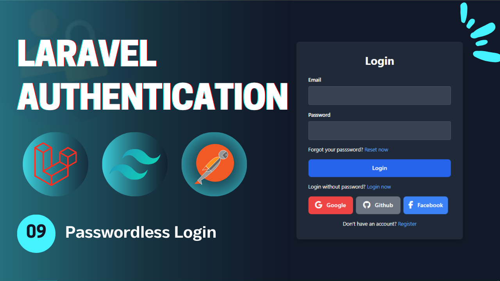
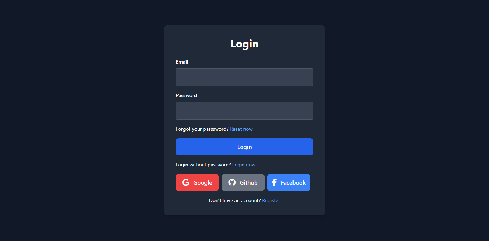

# Laravel Authentication - **Video 09: Passwordless Login**
  

## Overview 🌟

In this video, we focus on the **Passwordless Login** process for a Laravel application. Specifically, we implement:

- **Login Without password (Magic Login)** 🔒  

The goal is to ensure providing different ways to authenticate to your application.

🎥 **Watch the full video here:** [09: Passwordless Login - Laravel Authentication](https://youtu.be/ARuo3uzq4Jk)

---

## UI Design 🎨

Here are the designs related to the **Passwordless Login**:

- **Login Page**  
    

---

## Folder Structure 📁

Here is the folder structure for the relevant parts of the **Passwordless Login** process:

```
📂 app
 ├── 📂 Http
 │    ├── 📂 Controllers
 │    │    └── Auth
 │    │        ├── LoginController.php
 │    │        ├── RegisterController.php
 │    │        ├── LogoutController.php
 │    │        ├── UpateProfileController.php
 │    │        ├── ChangePasswordController.php
 │    │        ├── ForgotPasswordController.php
 │    │        ├── ResetPasswordController.php
 │    │        ├── VerifyAccountController.php
 │    │        ├── MagicAuthController.php
 │    │        └── SocialAuthController.php
 │    └── 📂 Requests
 │         └── Auth
 |              ├── LoginRequest.php
 │              ├── RegisterRequest.php
 │              ├── UpdateProfileRequest.php
 │              ├── ChangePasswordRequest.php
 │              ├── ForgotPasswordRequest.php
 │              ├── ResetPasswordRequest.php
 │              └── VerifyAccountRequest.php
 └── 📂 Mail
      ├── SendResetLinkMail.php
      ├── VerifyAccountMail.php
      └── SendMagicLinkMail.php
📂 resources
 └── 📂 views
      ├── 📂 auth
      |    ├── login.blade.php
      │    ├── register.blade.php
      │    ├── forgot-password.blade.php
      │    ├── reset-password.blade.php
      │    ├── profile.blade.php
      │    ├── verify-email.blade.php
      │    └── passwordless-login.blade.php
      ├── 📂 emails
      │    ├── reset-password.blade.php
      │    ├── verify-account.blade.php
      │    └── passwordless-login.blade.php
      └── index.blade.php
📂 routes
 └── web.php
```

---

## Routes 🛤️

Below is the list of all relevant routes, including the **Email Verification** route:

| **HTTP Method** | **Route**                    | **Controller**              | **Auth**  | **Description**                          |
|-----------------|------------------------------|-----------------------------|-----------|------------------------------------------|
| `GET`           | `/login`                     | -                           | Guest     | Display the login form.                  |
| `GET`           | `/register`                  | -                           | Guest     | Display the registration form.           |
| `POST`          | `/login`                     | `LoginController`           | Guest     | Handle login submissions.                |
| `POST`          | `/register`                  | `RegisterController`        | Guest     | Handle registration submissions.         |
| `GET`           | `/verify-email/{email}`      | `VerifyAccountController`   | Guest     | Display the email verification form.     |
| `POST`          | `/verify-email`              | `VerifyAccountController`   | Guest     | Handle email verification.               |
| `GET`           | `/forgot-password`           | -                           | Guest     | Display the forgot password form.        |
| `GET`           | `/reset-password/{token}`    | -                           | Guest     | Display the reset password form.         |
| `POST`          | `/forgot-password`           | `ForgotPasswordController`  | Guest     | Handle forgot password submission.       |
| `POST`          | `/reset-password`            | `ResetPasswordController`   | Guest     | Handle password reset submission.        |
| `GET`           | `/auth/{driver}/redirect`    | `SocialAuthController`      | Guest     | Redirect to social service to login.     |
| `GET`           | `/auth/{driver}/callback`    | `SocialAuthController`      | Guest     | Callback from social to perform login.   |
| `GET`           | `/login/magic`               | -                           | Guest     | Display the login without password page. |
| `POST`          | `/login/magic`               | `MagicLoginController`      | Guest     | Send the mail in order to login.         |
| `GET`           | `/login/magic/{user}`        | `MagicLoginController`      | Guest     | Log the user in.                         |
| `POST`          | `/logout`                    | `LogoutController`          | Auth      | Log out the user.                        |
| `GET`           | `/profile`                   | -                           | Auth      | Display the profile page (auth).         |
| `PUT`           | `/profile`                   | `UpdateProfileController`   | Auth      | Update the profile info (auth).          |
| `POST`          | `/change-password`           | `ChangePasswordController`  | Auth      | Change the user password (auth).         |

---

## Implementation Details 🛠️

### **Controllers** 📄

#### `MagicLoginController`

The **MagicLoginController** handles sending email to the user wants to login without password, by making the url *temporarySignedRoute* which means it will be a short time life and will be signed to this user only. after sending this link to the user's email, when he clicks on the link it will redirect to the **loginHandler** function which logging the user automatically.

```php
class MagicLoginController extends Controller{

  public function sendMagicLink(ValidateEmailRequest $request){
    $user = User::where('email', $request->email)->first();

    $url = URL::temporarySignedRoute(
      'login.magic.handler', now()->addMinutes(10), ['user' => $user->id]
    );
    Mail::to($user->email)->send(new SendMagicLinkMail($url));

    return back()->with('success', 'We have sent you a login link to your email');
  }

  public function loginHandler(User $user){
    Auth::login($user);
    return redirect()->intended('/profile')->with('success', 'You are in');
  }
}
```

---

### **Mail Class** 📧

#### `SendMagicLinkMail`  
Handles sending the password reset link via email.

```php
class SendResetLinkMail extends Mailable {
    use Queueable, SerializesModels;

    public $loginLink;

    public function __construct(string $url) {
        $this->loginLink = $url;
    }

    public function envelope(): Envelope {
        return new Envelope(subject: 'Magic Login Mail');
    }

    public function content(): Content {
        return new Content(view: 'emails.passwordless-login');
    }

    public function attachments(): array {
        return [];
    }
}
```
---


## Key Features ✨

- **Passwordless Login Flow**: Login without password functionality.  
- **Controller Design**: Modular controllers to handle the authentication process process.  
- **Flash Messages**: User feedback for successful or failed actions.  

---

## How to Use 🚀

1. Clone the repository:  
   ```bash
   git clone https://github.com/Abdogoda/Laravel-Authentication.git
   cd Laravel-Authentication/09_passwordless_login
   ```

2. Install dependencies:  
   ```bash
   composer install
   ```

3. Set up configurations:  
   ```bash
   cp .env.example .env
   ```


4. Generate App Key
   ```bash
   php artisan key:generate
   ```

5. Set up the database (SQLITE):  
   ```bash
   php artisan migrate
   ```

6. Start the development server:  
   ```bash
   php artisan serve
   ```

7. Access the app in your browser at `http://localhost:8000`.

---

## Next Steps ▶️

In the next video, we'll expand this series's features by logging with email or phone number.  
🎥 **Watch the full playlist here:** [Laravel Authentication](https://youtube.com/playlist?list=PLBy71Vfd0SzVaLjezaxqjnSsK8_p_aTcp&si=p3DluiMX7-euuw3A)
