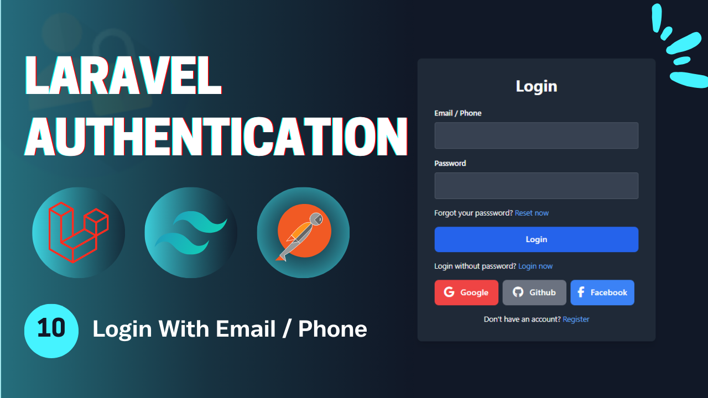
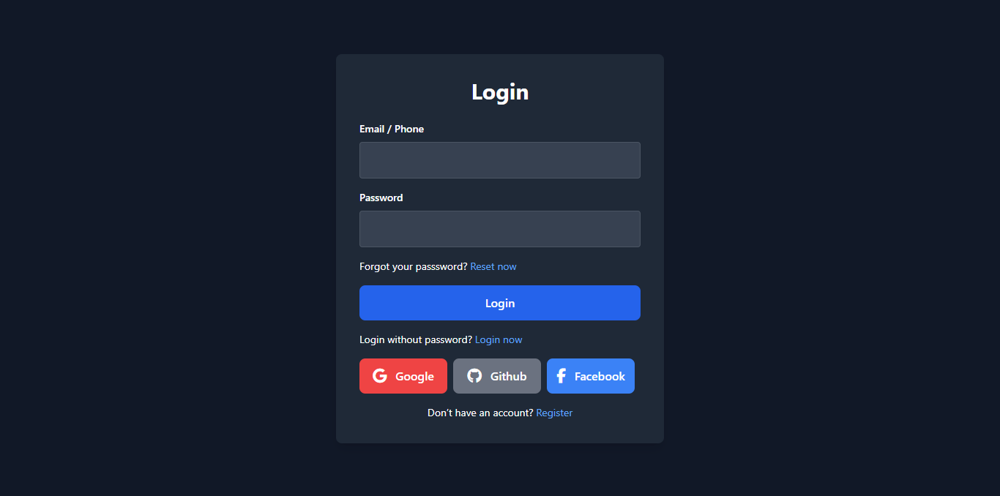

# Laravel Authentication - **Video 10: Login With Email & Phone**
  

## Overview 🌟

In this video, we focus on the **Login With Email & Phone** process for a Laravel application. Specifically, we implement:

- **Register with phone** 📞  
- **Login with email or phone** 🔒  

The goal is to provide different ways to authenticate to your application.

🎥 **Watch the full video here:** [10: Login With Email & Phone - Laravel Authentication](https://youtu.be/NKGE_hiahC8)

---

## UI Design 🎨

Here are the designs related to the **Login With Email & Phone**:

- **Login Page**  
    

---

## Folder Structure 📁

Here is the folder structure for the relevant parts of the **Login With Email & Phone** process:

```
📂 app
 ├── 📂 Http
 │    ├── 📂 Controllers
 │    │    └── Auth
 │    │        ├── LoginController.php
 │    │        ├── RegisterController.php
 │    │        ├── LogoutController.php
 │    │        ├── UpateProfileController.php
 │    │        ├── ChangePasswordController.php
 │    │        ├── ForgotPasswordController.php
 │    │        ├── ResetPasswordController.php
 │    │        ├── VerifyAccountController.php
 │    │        ├── MagicAuthController.php
 │    │        └── SocialAuthController.php
 │    └── 📂 Requests
 │         └── Auth
 |              ├── LoginRequest.php
 │              ├── RegisterRequest.php
 │              ├── UpdateProfileRequest.php
 │              ├── ChangePasswordRequest.php
 │              ├── ForgotPasswordRequest.php
 │              ├── ResetPasswordRequest.php
 │              └── VerifyAccountRequest.php
 └── 📂 Mail
      ├── SendResetLinkMail.php
      ├── VerifyAccountMail.php
      └── SendMagicLinkMail.php
📂 resources
 └── 📂 views
      ├── 📂 auth
      |    ├── login.blade.php
      │    ├── register.blade.php
      │    ├── forgot-password.blade.php
      │    ├── reset-password.blade.php
      │    ├── profile.blade.php
      │    └── verify-email.blade.php
      ├── 📂 emails
      │    ├── reset-password.blade.php
      │    ├── verify-account.blade.php
      │    └── passwordless-login.blade.php
      └── index.blade.php
📂 routes
 └── web.php
```

---

## Routes 🛤️

Below is the list of all relevant routes, including the **Email Verification** route:

| **HTTP Method** | **Route**                    | **Controller**              | **Auth**  | **Description**                          |
|-----------------|------------------------------|-----------------------------|-----------|------------------------------------------|
| `GET`           | `/login`                     | -                           | Guest     | Display the login form.                  |
| `GET`           | `/register`                  | -                           | Guest     | Display the registration form.           |
| `POST`          | `/login`                     | `LoginController`           | Guest     | Handle login submissions.                |
| `POST`          | `/register`                  | `RegisterController`        | Guest     | Handle registration submissions.         |
| `GET`           | `/verify-email/{email}`      | `VerifyAccountController`   | Guest     | Display the email verification form.     |
| `POST`          | `/verify-email`              | `VerifyAccountController`   | Guest     | Handle email verification.               |
| `GET`           | `/forgot-password`           | -                           | Guest     | Display the forgot password form.        |
| `GET`           | `/reset-password/{token}`    | -                           | Guest     | Display the reset password form.         |
| `POST`          | `/forgot-password`           | `ForgotPasswordController`  | Guest     | Handle forgot password submission.       |
| `POST`          | `/reset-password`            | `ResetPasswordController`   | Guest     | Handle password reset submission.        |
| `GET`           | `/auth/{driver}/redirect`    | `SocialAuthController`      | Guest     | Redirect to social service to login.     |
| `GET`           | `/auth/{driver}/callback`    | `SocialAuthController`      | Guest     | Callback from social to perform login.   |
| `GET`           | `/login/magic`               | -                           | Guest     | Display the login without password page. |
| `POST`          | `/login/magic`               | `MagicLoginController`      | Guest     | Send the mail in order to login.         |
| `GET`           | `/login/magic/{user}`        | `MagicLoginController`      | Guest     | Log the user in.                         |
| `POST`          | `/logout`                    | `LogoutController`          | Auth      | Log out the user.                        |
| `GET`           | `/profile`                   | -                           | Auth      | Display the profile page (auth).         |
| `PUT`           | `/profile`                   | `UpdateProfileController`   | Auth      | Update the profile info (auth).          |
| `POST`          | `/change-password`           | `ChangePasswordController`  | Auth      | Change the user password (auth).         |

---

## Implementation Details 🛠️

### **Controllers** 📄

#### `LoginController`

The **LoginController** handles login to the account via email or phone by validating the *identifier* field which represent the phone/email value then according to this will search the database for the user and then perform the logging process.

```php
class LoginController extends Controller{

  public function __invoke(LoginRequest $request){
    $type = filter_var($request->input('identifier'), FILTER_VALIDATE_EMAIL) ? 'email' : 'phone';
    
    $user = User::where($type, $request->identifier)->first();

    if(!$user || !Hash::check($request->password, $user->password)){
      return back()->with('error', 'Invalid credentials!');
    }

    if(!$user->email_verified_at){
      Mail::to($user->email)->send(new VerifyAccountMail($user->otp, $user->email));
      return redirect()->route('email.verify', $user->email);
    }

    Auth::login($user);
    return redirect()->intended('/profile')->with('success', 'You are in');
  }
}
```

---

### **Validation Requests** ✅

#### `LoginRequest`  
Validates login form inputs.

```php
public function rules(): array {
    return [
      'identifier' => 'required|max:255',
      'password' => 'required|string|max:255'
    ];
}
```
---


## Key Features ✨

- **Login With Email & Phone Flow**: Login using different ways.  
- **Controller Design**: Modular controllers to handle the authentication process process.  
- **Flash Messages**: User feedback for successful or failed actions.  

---

## How to Use 🚀

1. Clone the repository:  
   ```bash
   git clone https://github.com/Abdogoda/Laravel-Authentication.git
   cd Laravel-Authentication/10_login_with_email_phone
   ```

2. Install dependencies:  
   ```bash
   composer install
   ```

3. Set up configurations:  
   ```bash
   cp .env.example .env
   ```


4. Generate App Key
   ```bash
   php artisan key:generate
   ```

5. Set up the database (SQLITE):  
   ```bash
   php artisan migrate
   ```

6. Start the development server:  
   ```bash
   php artisan serve
   ```

7. Access the app in your browser at `http://localhost:8000`.

---

## Next Steps ▶️

In the next video, we'll expand this series's features by verifing the phone we just added to the user using OTP via whatsapp.  
🎥 **Watch the full playlist here:** [Laravel Authentication](https://youtube.com/playlist?list=PLBy71Vfd0SzVaLjezaxqjnSsK8_p_aTcp&si=p3DluiMX7-euuw3A)
