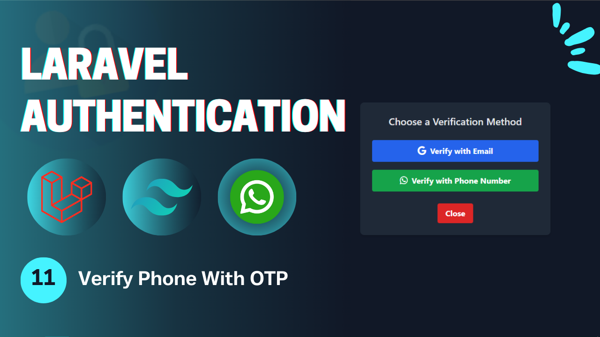

# Laravel Authentication - **Video 11: Verify Phone With OTP**
  

## Overview 🌟

In this video, we focus on the **Verify Phone With OTP** process for a Laravel application. Specifically, we implement:

- **Sending OTP to the user's phone via whatsapp** 📞  

The goal is to provide different ways to verify your application.

🎥 **Watch the full video here:** [11: Verify Phone With OTP - Laravel Authentication](https://youtu.be/8yCcGDtVc64)

---

## UI Design 🎨

Here are the designs related to the **Verify Phone With OTP**:

- **Login Page**  
    

---

## Folder Structure 📁

Here is the folder structure for the relevant parts of the **Verify Phone With OTP** process:

```
📂 app
 ├── 📂 Http
 │    ├── 📂 Controllers
 │    │    └── Auth
 │    │        ├── LoginController.php
 │    │        ├── RegisterController.php
 │    │        ├── LogoutController.php
 │    │        ├── UpateProfileController.php
 │    │        ├── ChangePasswordController.php
 │    │        ├── ForgotPasswordController.php
 │    │        ├── ResetPasswordController.php
 │    │        ├── VerifyAccountController.php
 │    │        ├── MagicAuthController.php
 │    │        └── SocialAuthController.php
 │    └── 📂 Requests
 │         └── Auth
 |              ├── LoginRequest.php
 │              ├── RegisterRequest.php
 │              ├── UpdateProfileRequest.php
 │              ├── ChangePasswordRequest.php
 │              ├── ForgotPasswordRequest.php
 │              ├── ResetPasswordRequest.php
 │              ├── VerifyAccountRequest.php
 │              └── SendVerificationOtpRequest.php
 ├── 📂 Mail
 │    ├── SendResetLinkMail.php
 │    ├── VerifyAccountMail.php
 │    └── SendMagicLinkMail.php
 └── 📂 Services
      └── PhoneVerificationService.php
📂 resources
 └── 📂 views
      ├── 📂 auth
      |    ├── login.blade.php
      │    ├── register.blade.php
      │    ├── forgot-password.blade.php
      │    ├── reset-password.blade.php
      │    ├── profile.blade.php
      │    └── verify-email.blade.php
      ├── 📂 emails
      │    ├── reset-password.blade.php
      │    ├── verify-account.blade.php
      │    └── passwordless-login.blade.php
      └── index.blade.php
📂 routes
 └── web.php
```

---

## Routes 🛤️

Below is the list of all relevant routes, including the **Email Verification** route:

| **HTTP Method** | **Route**                      | **Controller**              | **Auth**  | **Description**                          |
|-----------------|--------------------------------|-----------------------------|-----------|------------------------------------------|
| `GET`           | `/login`                       | -                           | Guest     | Display the login form.                  |
| `GET`           | `/register`                    | -                           | Guest     | Display the registration form.           |
| `POST`          | `/login`                       | `LoginController`           | Guest     | Handle login submissions.                |
| `POST`          | `/register`                    | `RegisterController`        | Guest     | Handle registration submissions.         |
| `GET`           | `/verify-account/{identifier}` | -                           | Guest     | Display the email verification form.     |
| `POST`          | `/verify-account`              | `VerifyAccountController`   | Guest     | Handle account verification.             |
| `POST`          | `/send-verification-otp`       | `VerifyAccountController`   | Guest     | Sending the verification request.        |
| `GET`           | `/forgot-password`             | -                           | Guest     | Display the forgot password form.        |
| `GET`           | `/reset-password/{token}`      | -                           | Guest     | Display the reset password form.         |
| `POST`          | `/forgot-password`             | `ForgotPasswordController`  | Guest     | Handle forgot password submission.       |
| `POST`          | `/reset-password`              | `ResetPasswordController`   | Guest     | Handle password reset submission.        |
| `GET`           | `/auth/{driver}/redirect`      | `SocialAuthController`      | Guest     | Redirect to social service to login.     |
| `GET`           | `/auth/{driver}/callback`      | `SocialAuthController`      | Guest     | Callback from social to perform login.   |
| `GET`           | `/login/magic`                 | -                           | Guest     | Display the login without password page. |
| `POST`          | `/login/magic`                 | `MagicLoginController`      | Guest     | Send the mail in order to login.         |
| `GET`           | `/login/magic/{user}`          | `MagicLoginController`      | Guest     | Log the user in.                         |
| `POST`          | `/logout`                      | `LogoutController`          | Auth      | Log out the user.                        |
| `GET`           | `/profile`                     | -                           | Auth      | Display the profile page (auth).         |
| `PUT`           | `/profile`                     | `UpdateProfileController`   | Auth      | Update the profile info (auth).          |
| `POST`          | `/change-password`             | `ChangePasswordController`  | Auth      | Change the user password (auth).         |

---

## Implementation Details 🛠️

### **Controllers** 📄

#### `LoginController`

The **LoginController** handles login to the account via email or phone by validating the *identifier* field which represent the phone/email value then according to this will search the database for the user and then perform the logging process.

```php
class VerifyAccountController extends Controller{

  public function __construct(public PhoneVerificationService $phoneVerificationService){}

  public function sendOtp(SendVerificationOtpRequest $request){
    $type = filter_var($request->input('identifier'), FILTER_VALIDATE_EMAIL) ? 'email' : 'phone';
    
    $user = User::where($type, $request->identifier)->first();

    if($user->account_verified_at){
      return redirect()->to('login')->with('success', 'You are already verified!');
    }

    if($request->method == 'email'){
      Mail::to($user->email)->send(new VerifyAccountMail($user->otp, $user->email));
    } 
    
    if($request->method == 'phone'){
      if(!$user->phone || $user->phone == ''){
        return back()->with('error', 'You do not have a phone number!');
      }

      try {
        $response = $this->phoneVerificationService->sendOtpMessage($user->phone, $user->otp);
        if($response->failed()){
          Log::info($response);
          return back()->with('error', 'Failed to send otp to this phone, try again later!');
        }
      } catch (\Throwable $th) {
        return back()->with('error', $th->getMessage());
      }
    }
    
    return redirect()->route('account.verify', $request->method == 'phone' ? $user->phone : $user->email);
  }

  public function verifyOtp(VerifyAccountRequest $request){

    $type = filter_var($request->input('identifier'), FILTER_VALIDATE_EMAIL) ? 'email' : 'phone';
    
    $user = User::where($type, $request->identifier)->first();
    if($user->otp != implode("", $request->otp)){
      return back()->with('error', 'Invalid OTP or account data');
    }

    $user->account_verified_at = now();
    $user->save();

    return redirect()->route("login")->with('success', 'Your Account verified successfully, you can login now');
  }
}
```

---

### **Validation Requests** ✅

#### `VerifyAccountRequest`  
Validates account verification request.

```php
public function rules(): array {
  return [
    'identifier' => 'required|string|max:255',
    'otp' => 'required|array|size:6',
    'otp.*' => 'required|numeric|digits:1'
  ];
}
```
---

### **Services** ✅

#### `PhoneVerificationService`  
Sending the otp message to the user's phone via whatsapp.

```php
public function sendOtpMessage(): array {
  // Sending the otp message to the user's phone via whatsapp...
}
```
---


## Key Features ✨

- **Verify Phone With OTP Flow**: Sending the OTP to the user's phone to verify his account.  
- **Controller Design**: Modular controllers to handle the authentication process process.  
- **Flash Messages**: User feedback for successful or failed actions.  

---

## How to Use 🚀

1. Clone the repository:  
   ```bash
   git clone https://github.com/Abdogoda/Laravel-Authentication.git
   cd Laravel-Authentication/11_verify_phone_with_otp
   ```

2. Install dependencies:  
   ```bash
   composer install
   ```

3. Set up configurations:  
   ```bash
   cp .env.example .env
   ```


4. Generate App Key
   ```bash
   php artisan key:generate
   ```

5. Set up the database (SQLITE):  
   ```bash
   php artisan migrate
   ```

6. Start the development server:  
   ```bash
   php artisan serve
   ```

7. Access the app in your browser at `http://localhost:8000`.

---

## Next Steps ▶️

In the next video, we'll expand this series's features by logging out user from other devices when he login to new one.  
🎥 **Watch the full playlist here:** [Laravel Authentication](https://youtube.com/playlist?list=PLBy71Vfd0SzVaLjezaxqjnSsK8_p_aTcp&si=p3DluiMX7-euuw3A)
