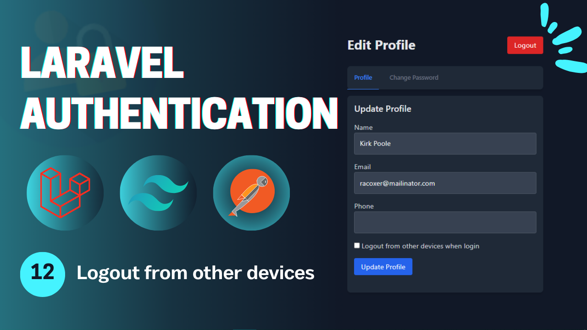
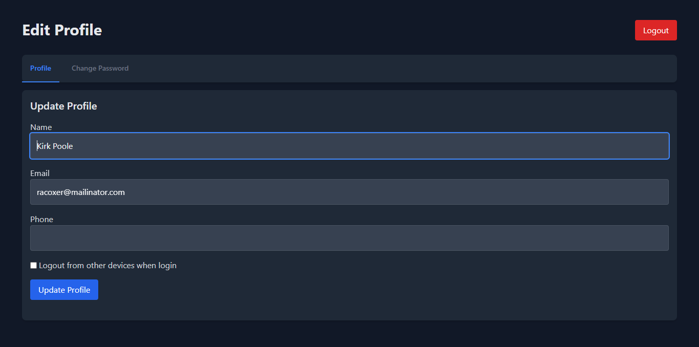

# Laravel Authentication - **Video 12: Logout from other devices**
  

## Overview 🌟

In this video, we focus on the **Logout from other devices** process for a Laravel application. Specifically, we implement:

- **Logging user out from all devices when login using new one** 🔒

The goal is to provide a secure way to deal with the user devices in your application.

🎥 **Watch the full video here:** [12: Logout from other devices - Laravel Authentication](https://youtu.be/GgPheZgf7Ow)

---

## UI Design 🎨

Here are the designs related to the **Logout from other devices**:

- **Profile Page**  
    

---

## Folder Structure 📁

Here is the folder structure for the relevant parts of the **Logout from other devices** process:

```
📂 app
 ├── 📂 Http
 │    ├── 📂 Controllers
 │    │    └── Auth
 │    │        ├── LoginController.php
 │    │        ├── RegisterController.php
 │    │        ├── LogoutController.php
 │    │        ├── UpateProfileController.php
 │    │        ├── ChangePasswordController.php
 │    │        ├── ForgotPasswordController.php
 │    │        ├── ResetPasswordController.php
 │    │        ├── VerifyAccountController.php
 │    │        ├── MagicAuthController.php
 │    │        └── SocialAuthController.php
 │    └── 📂 Requests
 │         └── Auth
 |              ├── LoginRequest.php
 │              ├── RegisterRequest.php
 │              ├── UpdateProfileRequest.php
 │              ├── ChangePasswordRequest.php
 │              ├── ForgotPasswordRequest.php
 │              ├── ResetPasswordRequest.php
 │              └── VerifyAccountRequest.php
 ├── 📂 Mail
 │    ├── SendResetLinkMail.php
 │    ├── VerifyAccountMail.php
 │    └── SendMagicLinkMail.php
 └── 📂 Services
      └── PhoneVerificationService.php
📂 resources
 └── 📂 views
      ├── 📂 auth
      |    ├── login.blade.php
      │    ├── register.blade.php
      │    ├── forgot-password.blade.php
      │    ├── reset-password.blade.php
      │    ├── profile.blade.php
      │    ├── verify-email.blade.php
      │    └── passwordless-login.blade.php
      ├── 📂 emails
      │    ├── reset-password.blade.php
      │    ├── verify-account.blade.php
      │    └── passwordless-login.blade.php
      └── index.blade.php
📂 routes
 └── web.php
```

---

## Routes 🛤️

Below is the list of all relevant routes, including the **Email Verification** route:

| **HTTP Method** | **Route**                      | **Controller**              | **Auth**  | **Description**                          |
|-----------------|--------------------------------|-----------------------------|-----------|------------------------------------------|
| `GET`           | `/login`                       | -                           | Guest     | Display the login form.                  |
| `GET`           | `/register`                    | -                           | Guest     | Display the registration form.           |
| `POST`          | `/login`                       | `LoginController`           | Guest     | Handle login submissions.                |
| `POST`          | `/register`                    | `RegisterController`        | Guest     | Handle registration submissions.         |
| `GET`           | `/verify-account/{identifier}` | -                           | Guest     | Display the email verification form.     |
| `POST`          | `/verify-account`              | `VerifyAccountController`   | Guest     | Handle account verification.             |
| `POST`          | `/send-verification-otp`       | `VerifyAccountController`   | Guest     | Sending the verification request.        |
| `GET`           | `/forgot-password`             | -                           | Guest     | Display the forgot password form.        |
| `GET`           | `/reset-password/{token}`      | -                           | Guest     | Display the reset password form.         |
| `POST`          | `/forgot-password`             | `ForgotPasswordController`  | Guest     | Handle forgot password submission.       |
| `POST`          | `/reset-password`              | `ResetPasswordController`   | Guest     | Handle password reset submission.        |
| `GET`           | `/auth/{driver}/redirect`      | `SocialAuthController`      | Guest     | Redirect to social service to login.     |
| `GET`           | `/auth/{driver}/callback`      | `SocialAuthController`      | Guest     | Callback from social to perform login.   |
| `GET`           | `/login/magic`                 | -                           | Guest     | Display the login without password page. |
| `POST`          | `/login/magic`                 | `MagicLoginController`      | Guest     | Send the mail in order to login.         |
| `GET`           | `/login/magic/{user}`          | `MagicLoginController`      | Guest     | Log the user in.                         |
| `POST`          | `/logout`                      | `LogoutController`          | Auth      | Log out the user.                        |
| `GET`           | `/profile`                     | -                           | Auth      | Display the profile page (auth).         |
| `PUT`           | `/profile`                     | `UpdateProfileController`   | Auth      | Update the profile info (auth).          |
| `POST`          | `/change-password`             | `ChangePasswordController`  | Auth      | Change the user password (auth).         |

---

## Implementation Details 🛠️

### **Controllers** 📄

#### `UpdateProfileController`

The **UpdateProfileController** handles updating the *logout_other_devices* boolean value in the database when updating the profile.

```php
class UpdateProfileController extends Controller{
  
  public function __invoke(UpdateProfileReqeust $request){
    $user = User::find(Auth::id());
    
    $data = $request->validated();
    $data['logout_other_devices'] = $request->has('logout_other_devices') ? true : false;
    $user->update($data);

    return back()->with('success', 'Profile updated successfully');
  }
}
```

#### `LoginController`

The **LoginController** handles logging this account out from other devices and login this device only.

```php
class LoginController extends Controller{
  
  public function __invoke(LoginRequest $request){
    $user = ; // Getting the user.

    Auth::login($user);
    if($user->logout_other_devices){
      Auth::logoutOtherDevices($request->password);
    }
  }
}
```

---

### **Validation Requests** ✅

#### `UpdateProfileReqeust`  
Validates updating the profile request.

```php
public function rules(): array {
  return [
    'logout_other_devices' => 'nullable|in:on,off'
  ];
}
```
---


## Key Features ✨

- **Logout from other devices Flow**: Logging user's account from all devices.  
- **Controller Design**: Modular controllers to handle the authentication process process.  
- **Flash Messages**: User feedback for successful or failed actions.  

---

## How to Use 🚀

1. Clone the repository:  
   ```bash
   git clone https://github.com/Abdogoda/Laravel-Authentication.git
   cd Laravel-Authentication/12_logout_from_other_devices
   ```

2. Install dependencies:  
   ```bash
   composer install
   ```

3. Set up configurations:  
   ```bash
   cp .env.example .env
   ```


4. Generate App Key
   ```bash
   php artisan key:generate
   ```

5. Set up the database (SQLITE):  
   ```bash
   php artisan migrate
   ```

6. Start the development server:  
   ```bash
   php artisan serve
   ```

7. Access the app in your browser at `http://localhost:8000`.

---

## Next Steps ▶️

In the next video, we'll expand this series's features by controlling browser sessions.  
🎥 **Watch the full playlist here:** [Laravel Authentication](https://youtube.com/playlist?list=PLBy71Vfd0SzVaLjezaxqjnSsK8_p_aTcp&si=p3DluiMX7-euuw3A)
