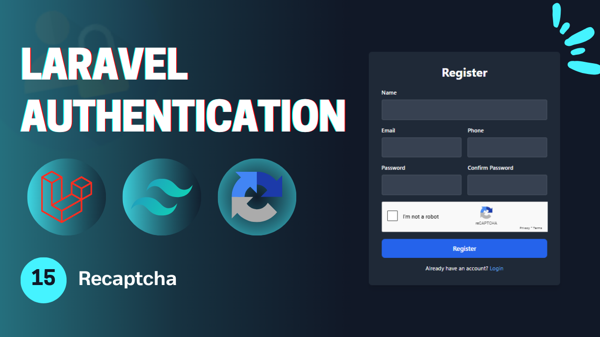
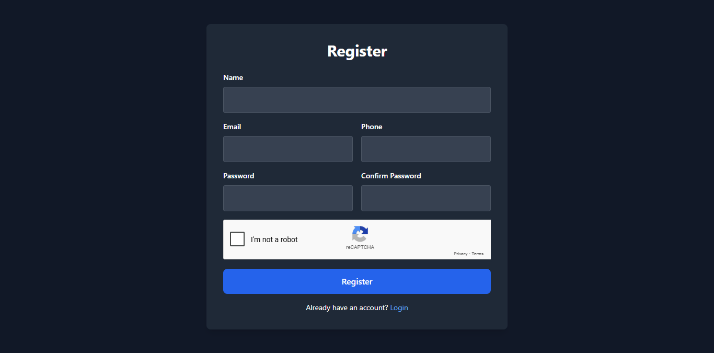
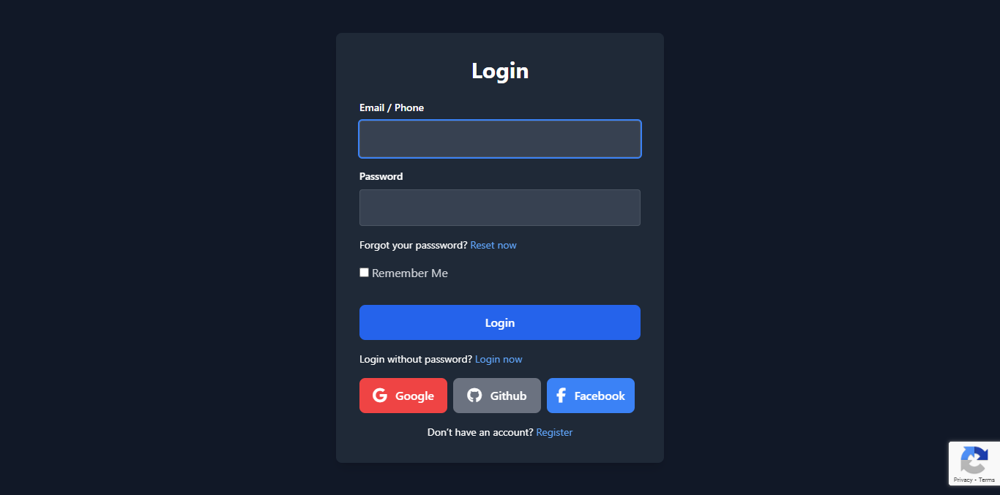

# Laravel Authentication - **Video 15: Recaptcha**
  

## Overview 🌟

In this video, we focus on applying the **Recaptcha** functionality for a Laravel application. 

The goal is to provide a way to add a layer of security to the application in order to prevent bots or automated attempts to use the application.

🎥 **Watch the full video here:** [15: Recaptcha - Laravel Authentication](https://youtu.be/FLSAdjNPBmI)

---

## UI Design 🎨

Here are the designs related to the **Recaptcha**:

- **Register Page**  
    

- **Login Page**  
    
---

## Folder Structure 📁

Here is the folder structure for the relevant parts of the **Recaptcha** process:

```
📂 app
 ├── 📂 Http
 │    ├── 📂 Controllers
 │    │    └── Auth
 │    │        ├── LoginController.php
 │    │        ├── RegisterController.php
 │    │        ├── LogoutController.php
 │    │        ├── UpateProfileController.php
 │    │        ├── ChangePasswordController.php
 │    │        ├── ForgotPasswordController.php
 │    │        ├── ResetPasswordController.php
 │    │        ├── VerifyAccountController.php
 │    │        ├── MagicAuthController.php
 │    │        └── SocialAuthController.php
 │    └── 📂 Requests
 │         └── Auth
 |              ├── LoginRequest.php
 │              ├── RegisterRequest.php
 │              ├── UpdateProfileRequest.php
 │              ├── ChangePasswordRequest.php
 │              ├── ForgotPasswordRequest.php
 │              ├── ResetPasswordRequest.php
 │              ├── VerifyAccountRequest.php
 │              └── SendVerificationOtpRequest.php
 ├── 📂 Mail
 │    ├── SendResetLinkMail.php
 │    ├── VerifyAccountMail.php
 │    └── SendMagicLinkMail.php
 └── 📂 Services
      └── PhoneVerificationService.php
📂 resources
 └── 📂 views
      ├── 📂 auth
      |    ├── login.blade.php
      │    ├── register.blade.php
      │    ├── forgot-password.blade.php
      │    ├── reset-password.blade.php
      │    ├── profile.blade.php
      │    └── verify-email.blade.php
      ├── 📂 emails
      │    ├── reset-password.blade.php
      │    ├── verify-account.blade.php
      │    └── passwordless-login.blade.php
      └── index.blade.php
📂 routes
 └── web.php
```

---

## Routes 🛤️

Below is the list of all relevant routes, including the **Email Verification** route:

| **HTTP Method** | **Route**                      | **Controller**              | **Auth**  | **Description**                          |
|-----------------|--------------------------------|-----------------------------|-----------|------------------------------------------|
| `GET`           | `/login`                       | -                           | Guest     | Display the login form.                  |
| `GET`           | `/register`                    | -                           | Guest     | Display the registration form.           |
| `POST`          | `/login`                       | `LoginController`           | Guest     | Handle login submissions.                |
| `POST`          | `/register`                    | `RegisterController`        | Guest     | Handle registration submissions.         |
| `GET`           | `/verify-account/{identifier}` | -                           | Guest     | Display the email verification form.     |
| `POST`          | `/verify-account`              | `VerifyAccountController`   | Guest     | Handle account verification.             |
| `POST`          | `/send-verification-otp`       | `VerifyAccountController`   | Guest     | Sending the verification request.        |
| `GET`           | `/forgot-password`             | -                           | Guest     | Display the forgot password form.        |
| `GET`           | `/reset-password/{token}`      | -                           | Guest     | Display the reset password form.         |
| `POST`          | `/forgot-password`             | `ForgotPasswordController`  | Guest     | Handle forgot password submission.       |
| `POST`          | `/reset-password`              | `ResetPasswordController`   | Guest     | Handle password reset submission.        |
| `GET`           | `/auth/{driver}/redirect`      | `SocialAuthController`      | Guest     | Redirect to social service to login.     |
| `GET`           | `/auth/{driver}/callback`      | `SocialAuthController`      | Guest     | Callback from social to perform login.   |
| `GET`           | `/login/magic`                 | -                           | Guest     | Display the login without password page. |
| `POST`          | `/login/magic`                 | `MagicLoginController`      | Guest     | Send the mail in order to login.         |
| `GET`           | `/login/magic/{user}`          | `MagicLoginController`      | Guest     | Log the user in.                         |
| `POST`          | `/logout`                      | `LogoutController`          | Auth      | Log out the user.                        |
| `POST`          | `/logout/{session}`            | `LogoutController`          | Auth      | Log out the user's session.              |
| `GET`           | `/profile`                     | -                           | Auth      | Display the profile page (auth).         |
| `PUT`           | `/profile`                     | `UpdateProfileController`   | Auth      | Update the profile info (auth).          |
| `POST`          | `/change-password`             | `ChangePasswordController`  | Auth      | Change the user password (auth).         |

---

## Implementation Details 🛠️

### **Request Validation** ⚙

#### `LoginRequest`

The **LoginRequest** add the recaptcha validation to the login request.

```php
class LoginRequest extends FormRequest{
    
  public function rules(): array{
    return [
      'identifier' => 'required|max:255',
      'password' => 'required|string|max:255',
      'remember' => 'nullable|in:on,off',
      'g-recaptcha-response' => ['required', new RecaptchaV3Rule]
    ];
  }
}
```
---
#### `RegisterRequest`

The **RegisterRequest** add the recaptcha validation to the register request.

```php
class RegisterRequest extends FormRequest{
    
  public function rules(): array{
    return [
      'name' => 'required|string|max:255',
      'email' => 'required|string|email|unique:users,email',
      'phone' => 'nullable|string|unique:users,phone|regex:/^01[0,1,2,5][0-9]{8}$/', 
      'password' => 'required|string|min:6|confirmed',
      'g-recaptcha-response' => 'required|recaptcha'
    ];
  }
}
```
---

### **Rules** 📃

#### `RecaptchaV3Rule`

The **RecaptchaV3Rule** sends http post request to the google recaptcha api service to verify this v3 recaptcha.

```php
class RecaptchaV3Rule implements ValidationRule{

  public function validate(string $attribute, mixed $value, Closure $fail): void{
    $response = Http::asForm()->post('https://www.google.com/recaptcha/api/siteverify', [
      'secret' => config('services.recaptchav3.secret_key'),
      'response' => $value,
      'remoteip' => request()->ip
    ]);

    if(!$response->successful() || $response->json('score') < 0.5){
      $fail("The Recaptcha Is Invalid");
    }
  }
}
```
---


## Key Features ✨

- **Recaptcha Flow**: Add recaptch to login and register process.  
- **Controller Design**: Modular controllers to handle the authentication process process.  
- **Flash Messages**: User feedback for successful or failed actions.  

---

## How to Use 🚀

1. Clone the repository:  
   ```bash
   git clone https://github.com/Abdogoda/Laravel-Authentication.git
   cd Laravel-Authentication/15_recaptcha
   ```

2. Install dependencies:  
   ```bash
   composer install
   ```

3. Set up configurations:  
   ```bash
   cp .env.example .env
   ```


4. Generate App Key
   ```bash
   php artisan key:generate
   ```

5. Set up the database (SQLITE):  
   ```bash
   php artisan migrate
   ```

6. Start the development server:  
   ```bash
   php artisan serve
   ```

7. Access the app in your browser at `http://localhost:8000`.

---

## Next Steps ▶️

In the next video, we'll expand this series's features by talking about role based authentication.  
🎥 **Watch the full playlist here:** [Laravel Authentication](https://youtube.com/playlist?list=PLBy71Vfd0SzVaLjezaxqjnSsK8_p_aTcp&si=p3DluiMX7-euuw3A)
