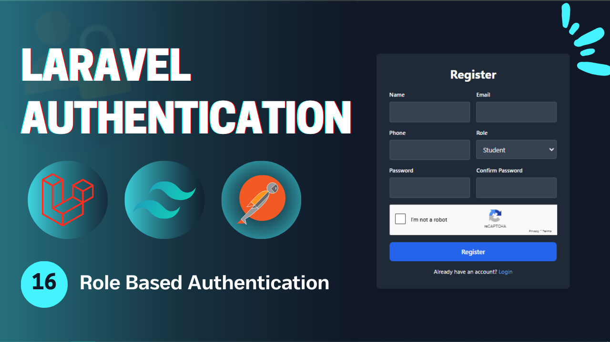
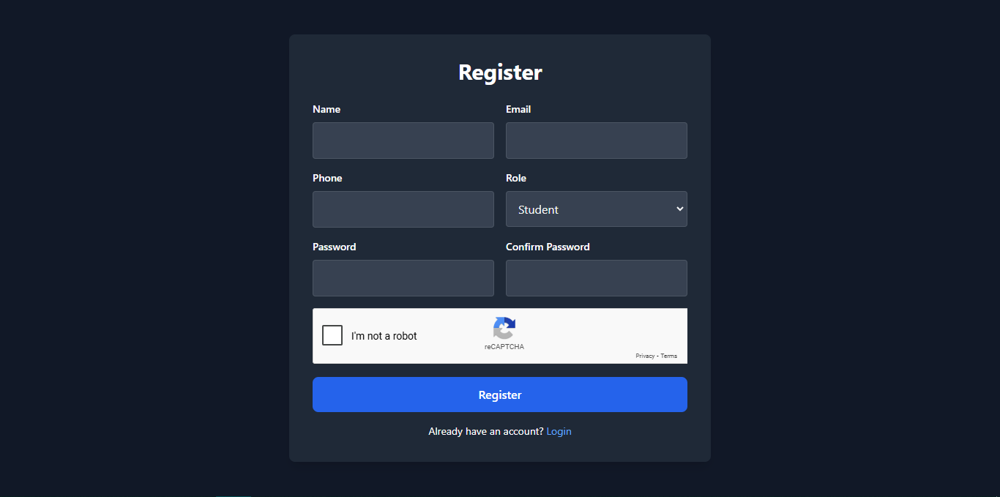
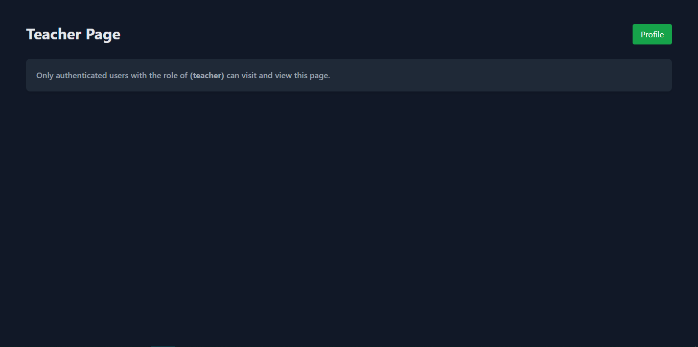

# Laravel Authentication - **Video 16: Role Based Authentication**
  

## Overview 🌟

In this video, we focus on applying the **Role Based Authentication** functionality for a Laravel application. 

The goal is to provide a way to add a layer of security to the application in order to prevent bots or automated attempts to use the application.

🎥 **Watch the full video here:** [16: Role Based Authentication - Laravel Authentication](https://youtu.be/Vp6cUHrJU18)

---

## UI Design 🎨

Here are the designs related to the **Role Based Authentication**:

- **Register Page**  
    

- **Role Page**  
    
---

## Folder Structure 📁

Here is the folder structure for the relevant parts of the **Role Based Authentication** process:

```
📂 app
 ├── 📂 Http
 │    ├── 📂 Controllers
 │    │    └── Auth
 │    │        ├── LoginController.php
 │    │        ├── RegisterController.php
 │    │        ├── LogoutController.php
 │    │        ├── UpateProfileController.php
 │    │        ├── ChangePasswordController.php
 │    │        ├── ForgotPasswordController.php
 │    │        ├── ResetPasswordController.php
 │    │        ├── VerifyAccountController.php
 │    │        ├── MagicAuthController.php
 │    │        └── SocialAuthController.php
 │    ├── 📂 Middleware
 │    │    └── RoleMiddleware.php
 │    └── 📂 Requests
 │         └── Auth
 |              ├── LoginRequest.php
 │              ├── RegisterRequest.php
 │              ├── UpdateProfileRequest.php
 │              ├── ChangePasswordRequest.php
 │              ├── ForgotPasswordRequest.php
 │              ├── ResetPasswordRequest.php
 │              └── VerifyAccountRequest.php
 ├── 📂 Mail
 │    ├── SendResetLinkMail.php
 │    ├── VerifyAccountMail.php
 │    └── SendMagicLinkMail.php
 ├── 📂 Services
 │    └── PhoneVerificationService.php
 └── 📂 Rules
      └── RecaptchaV3Rule.php
📂 resources
 └── 📂 views
      ├── 📂 auth
      |    ├── login.blade.php
      │    ├── register.blade.php
      │    ├── forgot-password.blade.php
      │    ├── reset-password.blade.php
      │    ├── profile.blade.php
      │    ├── verify-email.blade.php
      │    └── passwordless-login.blade.php
      ├── 📂 pages
      │    ├── admin.blade.php
      │    ├── student.blade.php
      │    └── teacher.blade.php
      ├── 📂 emails
      │    ├── reset-password.blade.php
      │    ├── verify-account.blade.php
      │    └── passwordless-login.blade.php
      └── index.blade.php
📂 routes
 └── web.php
```

---

## Routes 🛤️

Below is the list of all relevant routes, including the **Email Verification** route:

| **HTTP Method** | **Route**                      | **Controller**              | **Auth**  | **Description**                          |
|-----------------|--------------------------------|-----------------------------|-----------|------------------------------------------|
| `GET`           | `/login`                       | -                           | Guest     | Display the login form.                  |
| `GET`           | `/register`                    | -                           | Guest     | Display the registration form.           |
| `POST`          | `/login`                       | `LoginController`           | Guest     | Handle login submissions.                |
| `POST`          | `/register`                    | `RegisterController`        | Guest     | Handle registration submissions.         |
| `GET`           | `/verify-account/{identifier}` | -                           | Guest     | Display the email verification form.     |
| `POST`          | `/verify-account`              | `VerifyAccountController`   | Guest     | Handle account verification.             |
| `POST`          | `/send-verification-otp`       | `VerifyAccountController`   | Guest     | Sending the verification request.        |
| `GET`           | `/forgot-password`             | -                           | Guest     | Display the forgot password form.        |
| `GET`           | `/reset-password/{token}`      | -                           | Guest     | Display the reset password form.         |
| `POST`          | `/forgot-password`             | `ForgotPasswordController`  | Guest     | Handle forgot password submission.       |
| `POST`          | `/reset-password`              | `ResetPasswordController`   | Guest     | Handle password reset submission.        |
| `GET`           | `/auth/{driver}/redirect`      | `SocialAuthController`      | Guest     | Redirect to social service to login.     |
| `GET`           | `/auth/{driver}/callback`      | `SocialAuthController`      | Guest     | Callback from social to perform login.   |
| `GET`           | `/login/magic`                 | -                           | Guest     | Display the login without password page. |
| `POST`          | `/login/magic`                 | `MagicLoginController`      | Guest     | Send the mail in order to login.         |
| `GET`           | `/login/magic/{user}`          | `MagicLoginController`      | Guest     | Log the user in.                         |
| `POST`          | `/logout`                      | `LogoutController`          | Auth      | Log out the user.                        |
| `POST`          | `/logout/{session}`            | `LogoutController`          | Auth      | Log out the user's session.              |
| `GET`           | `/profile`                     | -                           | Auth      | Display the profile page (auth).         |
| `PUT`           | `/profile`                     | `UpdateProfileController`   | Auth      | Update the profile info (auth).          |
| `POST`          | `/change-password`             | `ChangePasswordController`  | Auth      | Change the user password (auth).         |
| `GET`           | `/student`                     | -                           | Auth      | View the student page.                   |
| `GET`           | `/teacher`                     | -                           | Auth      | View the teacher page.                   |
| `GET`           | `/admin`                       | -                           | Auth      | View the admin page.                     |

---

## Implementation Details 🛠️

### **Database** 📑

#### `add_role_to_users_table`

The **add_role_to_users_table** 

```php
Schema::table('users', function (Blueprint $table) {
  $table->enum('role', ['student', 'teacher', 'admin'])->default('student');
});
```

and then run 
```bash
 php artisan migrate
```
---

### **Controllers** ⚙

#### `LoginController`

The **LoginController** redirect to the corresponding protected page to the user's role.

```php
class LoginController extends Controller{

  public function __invoke(LoginRequest $request){
    $user = ; // Get the user

    Auth::login($user, $request->filled('remember'));
    
    $urls = [
        'student' => '/student',
        'teacher' => '/teacher',
        'admin' => '/admin',
    ];

    return redirect()->intended($urls[$user->role] ?? '/profile')->with('success', 'You are in');
  }
}
```
---

### **Middleware** 🛡

#### `RoleMiddleware`

The **RoleMiddleware** checks if the authenticated user has the specified role or abort him unauthorized.

```php
class RoleMiddleware{
    
  public function handle(Request $request, Closure $next, string $role): Response{
    if(Auth::user()->role != $role) abort(403, 'Unauthorized action');
    return $next($request);
  }
}
```

And here is how to use it in the *route.php* file:
```php
Route::middleware(['auth', 'auth.session'])->group(function(){
  
  //  PAGE ROUTES 
  Route::view('student', 'pages.student')->middleware('role:student');
  Route::view('teacher', 'pages.teacher')->middleware('role:teacher');
  Route::view('admin', 'pages.admin')->middleware('role:admin');
});
```
---


## Key Features ✨

- **Role Based Authentication Flow**: Add role to the users table and perform authorization.  
- **Controller Design**: Modular controllers to handle the authentication process process.  
- **Flash Messages**: User feedback for successful or failed actions.  

---

## How to Use 🚀

1. Clone the repository:  
   ```bash
   git clone https://github.com/Abdogoda/Laravel-Authentication.git
   cd Laravel-Authentication/16_role_based_authentication
   ```

2. Install dependencies:  
   ```bash
   composer install
   ```

3. Set up configurations:  
   ```bash
   cp .env.example .env
   ```


4. Generate App Key
   ```bash
   php artisan key:generate
   ```

5. Set up the database (SQLITE):  
   ```bash
   php artisan migrate
   ```

6. Start the development server:  
   ```bash
   php artisan serve
   ```

7. Access the app in your browser at `http://localhost:8000`.

---

## Next Steps ▶️

In the next video, we'll expand this series's features by talking about how to create admin user with an admin role using commands.  
🎥 **Watch the full playlist here:** [Laravel Authentication](https://youtube.com/playlist?list=PLBy71Vfd0SzVaLjezaxqjnSsK8_p_aTcp&si=p3DluiMX7-euuw3A)
