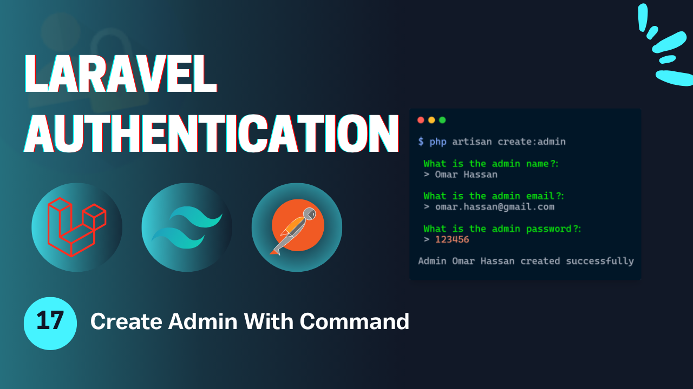
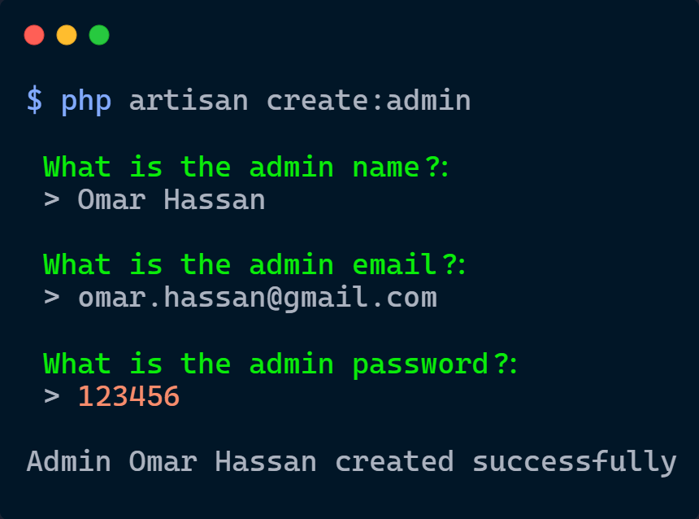

# Laravel Authentication - **Video 17: Create Admin With Command**
  

## Overview 🌟

In this video, we focus on applying the **Create Admin With Command** functionality for a Laravel application. 

The goal is to create an admin account using the command to make the application secure and pervent anyone to create the admin account unless the owner of the website.

🎥 **Watch the full video here:** [17: Create Admin With Command - Laravel Authentication](https://youtu.be/lYSe1lbKeqs)

---

## UI Design 🎨

Here are the designs related to the **Create Admin With Command**:

- **Command**  
    
---

## Folder Structure 📁

Here is the folder structure for the relevant parts of the **Create Admin With Command** process:

```
📂 app
 ├── 📂 Http
 │    └── 📂 Commands
 │         └── CreateAdminCommand.php
 ├── 📂 Http
 │    ├── 📂 Controllers
 │    │    └── Auth
 │    │        ├── LoginController.php
 │    │        ├── RegisterController.php
 │    │        ├── LogoutController.php
 │    │        ├── UpateProfileController.php
 │    │        ├── ChangePasswordController.php
 │    │        ├── ForgotPasswordController.php
 │    │        ├── ResetPasswordController.php
 │    │        ├── VerifyAccountController.php
 │    │        ├── MagicAuthController.php
 │    │        └── SocialAuthController.php
 │    ├── 📂 Middleware
 │    │    └── RoleMiddleware.php
 │    └── 📂 Requests
 │         └── Auth
 |              ├── LoginRequest.php
 │              ├── RegisterRequest.php
 │              ├── UpdateProfileRequest.php
 │              ├── ChangePasswordRequest.php
 │              ├── ForgotPasswordRequest.php
 │              ├── ResetPasswordRequest.php
 │              └── VerifyAccountRequest.php
 ├── 📂 Mail
 │    ├── SendResetLinkMail.php
 │    ├── VerifyAccountMail.php
 │    └── SendMagicLinkMail.php
 ├── 📂 Services
 │    └── PhoneVerificationService.php
 └── 📂 Rules
      └── RecaptchaV3Rule.php
📂 resources
 └── 📂 views
      ├── 📂 auth
      |    ├── login.blade.php
      │    ├── register.blade.php
      │    ├── forgot-password.blade.php
      │    ├── reset-password.blade.php
      │    ├── profile.blade.php
      │    ├── verify-email.blade.php
      │    └── passwordless-login.blade.php
      ├── 📂 pages
      │    ├── admin.blade.php
      │    ├── student.blade.php
      │    └── teacher.blade.php
      ├── 📂 emails
      │    ├── reset-password.blade.php
      │    ├── verify-account.blade.php
      │    └── passwordless-login.blade.php
      └── index.blade.php
📂 routes
 └── web.php
```

---

## Routes 🛤️

Below is the list of all relevant routes, including the **Email Verification** route:

| **HTTP Method** | **Route**                      | **Controller**              | **Auth**  | **Description**                          |
|-----------------|--------------------------------|-----------------------------|-----------|------------------------------------------|
| `GET`           | `/login`                       | -                           | Guest     | Display the login form.                  |
| `GET`           | `/register`                    | -                           | Guest     | Display the registration form.           |
| `POST`          | `/login`                       | `LoginController`           | Guest     | Handle login submissions.                |
| `POST`          | `/register`                    | `RegisterController`        | Guest     | Handle registration submissions.         |
| `GET`           | `/verify-account/{identifier}` | -                           | Guest     | Display the email verification form.     |
| `POST`          | `/verify-account`              | `VerifyAccountController`   | Guest     | Handle account verification.             |
| `POST`          | `/send-verification-otp`       | `VerifyAccountController`   | Guest     | Sending the verification request.        |
| `GET`           | `/forgot-password`             | -                           | Guest     | Display the forgot password form.        |
| `GET`           | `/reset-password/{token}`      | -                           | Guest     | Display the reset password form.         |
| `POST`          | `/forgot-password`             | `ForgotPasswordController`  | Guest     | Handle forgot password submission.       |
| `POST`          | `/reset-password`              | `ResetPasswordController`   | Guest     | Handle password reset submission.        |
| `GET`           | `/auth/{driver}/redirect`      | `SocialAuthController`      | Guest     | Redirect to social service to login.     |
| `GET`           | `/auth/{driver}/callback`      | `SocialAuthController`      | Guest     | Callback from social to perform login.   |
| `GET`           | `/login/magic`                 | -                           | Guest     | Display the login without password page. |
| `POST`          | `/login/magic`                 | `MagicLoginController`      | Guest     | Send the mail in order to login.         |
| `GET`           | `/login/magic/{user}`          | `MagicLoginController`      | Guest     | Log the user in.                         |
| `POST`          | `/logout`                      | `LogoutController`          | Auth      | Log out the user.                        |
| `POST`          | `/logout/{session}`            | `LogoutController`          | Auth      | Log out the user's session.              |
| `GET`           | `/profile`                     | -                           | Auth      | Display the profile page (auth).         |
| `PUT`           | `/profile`                     | `UpdateProfileController`   | Auth      | Update the profile info (auth).          |
| `POST`          | `/change-password`             | `ChangePasswordController`  | Auth      | Change the user password (auth).         |
| `GET`           | `/student`                     | -                           | Auth      | View the student page.                   |
| `GET`           | `/teacher`                     | -                           | Auth      | View the teacher page.                   |
| `GET`           | `/admin`                       | -                           | Auth      | View the admin page.                     |

---

## Implementation Details 🛠️

### **Commands** 📑

#### `CreateAdminCommand`

The **CreateAdminCommand** creates an admin using the admin role.

```php
class CreateAdminCommand extends Command{
  
  protected $signature = 'create:admin';

  protected $description = 'This command creates an admin user';

  public function handle(){

    $name = $this->ask('What is the admin name?');
    $email = $this->ask('What is the admin email?');
    $password = $this->ask('What is the admin password?');

    $validator = Validator::make([
      'name' => $name,
      'email' => $email,
      'password' => $password
    ], [
      'name' => 'required|string|max:255',
      'email' => 'required|string|email|unique:users,email',
      'password' => 'required|string|min:6'
    ]);

    if($validator->fails()){
      foreach($validator->errors()->all() as $error){
        $this->error($error);
      }
      return;
    }

    $user = User::create([
      'name' => $name,
      'email' => $email,
      'role' => 'admin',
      'email_verified_at' => now(),
      'password' => Hash::make($password),
      'otp' => rand(100000, 999999)
    ]);
    $this->info('Admin '. $name .' created successfully');
  }
}

```

and then run the command:
```bash
 php artisan create:admin
```
---


## Key Features ✨

- **Create Admin With Command Flow**: Creates the admin account using command.  
- **Controller Design**: Modular controllers to handle the authentication process process.  
- **Flash Messages**: User feedback for successful or failed actions.  

---

## How to Use 🚀

1. Clone the repository:  
   ```bash
   git clone https://github.com/Abdogoda/Laravel-Authentication.git
   cd Laravel-Authentication/17_create_admin_with_command
   ```

2. Install dependencies:  
   ```bash
   composer install
   ```

3. Set up configurations:  
   ```bash
   cp .env.example .env
   ```


4. Generate App Key
   ```bash
   php artisan key:generate
   ```

5. Set up the database (SQLITE):  
   ```bash
   php artisan migrate
   ```

6. Start the development server:  
   ```bash
   php artisan serve
   ```

7. Access the app in your browser at `http://localhost:8000`.

---

## Next Steps ▶️

In the next video, we'll expand this series's features by talking about roles and users CRUD operations.  
🎥 **Watch the full playlist here:** [Laravel Authentication](https://youtube.com/playlist?list=PLBy71Vfd0SzVaLjezaxqjnSsK8_p_aTcp&si=p3DluiMX7-euuw3A)
