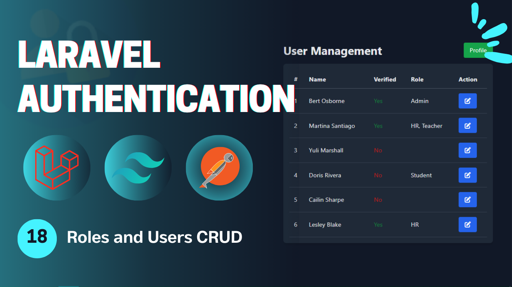
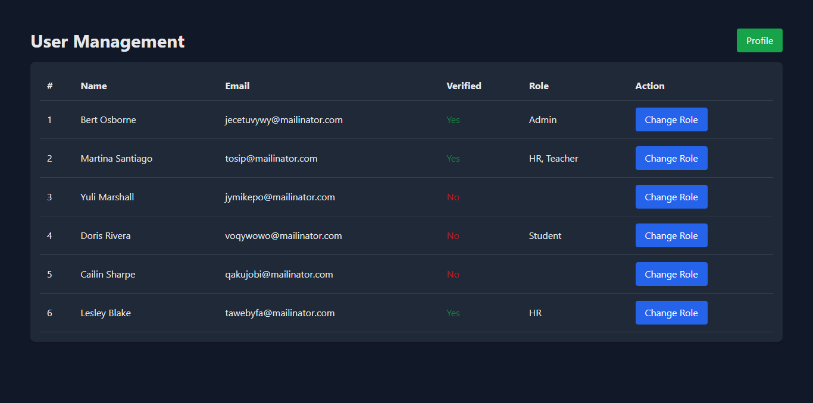
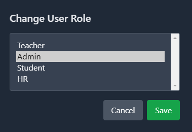
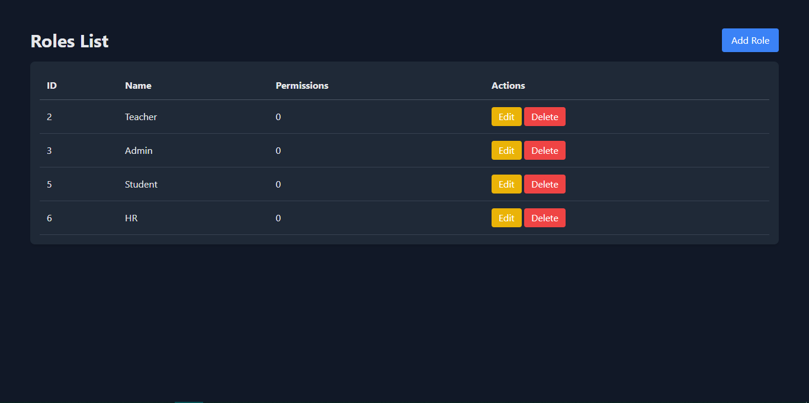
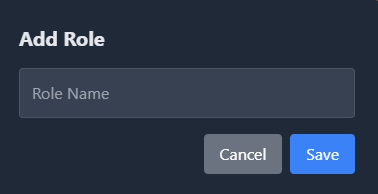
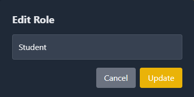

# Laravel Authentication - **Video 18: Roles and Users CRUD**
  

## Overview 🌟

In this video, we focus on applying the **Roles and Users CRUD** functionality for a Laravel application. 

The goal is to create, update, delete and view roles of the application in order to make them dynamic, and also view and change user role.

🎥 **Watch the full video here:** [18: Roles and Users CRUD - Laravel Authentication](https://youtu.be/mUd5U7---KA)

---

## UI Design 🎨

Here are the designs related to the **Roles and Users CRUD**:

- **Users Page**  
    
    

- **Roles Page**  
    
    
    
    
---

## Folder Structure 📁

Here is the folder structure for the relevant parts of the **Roles and Users CRUD** process:

```
📂 app
 ├── 📂 Http
 │    ├── 📂 Commands
 │    │     └── CreateAdminCommand.php
 │    ├── 📂 Controllers
 │    │    ├── Admin
 │    │    │    ├── RolesController.php
 │    │    │    └── UsersController.php
 │    │    └── Auth
 │    │         ├── LoginController.php
 │    │         ├── RegisterController.php
 │    │         ├── LogoutController.php
 │    │         ├── UpateProfileController.php
 │    │         ├── ChangePasswordController.php
 │    │         ├── ForgotPasswordController.php
 │    │         ├── ResetPasswordController.php
 │    │         ├── VerifyAccountController.php
 │    │         ├── MagicAuthController.php
 │    │         └── SocialAuthController.php
 │    ├── 📂 Middleware
 │    │    └── RoleMiddleware.php
 │    └── 📂 Requests
 │         ├── Admin
 │         │     ├── Roles
 |         │     │     ├── CreateRoleRequest.php
 │         │     │     └── UpdateRoleRequest.php
 │         │     └── Users
 │         │           └── ChangeUserRoleRequest.php
 │         └── Auth
 |              ├── LoginRequest.php
 │              ├── RegisterRequest.php
 │              ├── UpdateProfileRequest.php
 │              ├── ChangePasswordRequest.php
 │              ├── ForgotPasswordRequest.php
 │              ├── ResetPasswordRequest.php
 │              └── VerifyAccountRequest.php
 ├── 📂 Models
 │    ├── User.php
 │    ├── Role.php
 │    └── Session.php
 ├── 📂 Mail
 │    ├── SendResetLinkMail.php
 │    ├── VerifyAccountMail.php
 │    └── SendMagicLinkMail.php
 ├── 📂 Services
 │    └── PhoneVerificationService.php
 └── 📂 Rules
      └── RecaptchaV3Rule.php
📂 resources
 └── 📂 views
      ├── 📂 admin
      |    ├── 📂 users
      │    │        └── index.blade.php
      |    └── 📂 roles
      │             └── index.blade.php
      ├── 📂 auth
      |    ├── login.blade.php
      │    ├── register.blade.php
      │    ├── forgot-password.blade.php
      │    ├── reset-password.blade.php
      │    ├── profile.blade.php
      │    ├── verify-email.blade.php
      │    └── passwordless-login.blade.php
      ├── 📂 pages
      │    ├── admin.blade.php
      │    ├── student.blade.php
      │    └── teacher.blade.php
      ├── 📂 emails
      │    ├── reset-password.blade.php
      │    ├── verify-account.blade.php
      │    └── passwordless-login.blade.php
      └── index.blade.php
📂 routes
 └── web.php
```

---

## Routes 🛤️

Below is the list of all relevant routes, including the **Email Verification** route:

| **HTTP Method** | **Route**                      | **Controller**              | **Auth**  | **Description**                          |
|-----------------|--------------------------------|-----------------------------|-----------|------------------------------------------|
| `GET`           | `/login`                       | -                           | Guest     | Display the login form.                  |
| `GET`           | `/register`                    | -                           | Guest     | Display the registration form.           |
| `POST`          | `/login`                       | `LoginController`           | Guest     | Handle login submissions.                |
| `POST`          | `/register`                    | `RegisterController`        | Guest     | Handle registration submissions.         |
| `GET`           | `/verify-account/{identifier}` | -                           | Guest     | Display the email verification form.     |
| `POST`          | `/verify-account`              | `VerifyAccountController`   | Guest     | Handle account verification.             |
| `POST`          | `/send-verification-otp`       | `VerifyAccountController`   | Guest     | Sending the verification request.        |
| `GET`           | `/forgot-password`             | -                           | Guest     | Display the forgot password form.        |
| `GET`           | `/reset-password/{token}`      | -                           | Guest     | Display the reset password form.         |
| `POST`          | `/forgot-password`             | `ForgotPasswordController`  | Guest     | Handle forgot password submission.       |
| `POST`          | `/reset-password`              | `ResetPasswordController`   | Guest     | Handle password reset submission.        |
| `GET`           | `/auth/{driver}/redirect`      | `SocialAuthController`      | Guest     | Redirect to social service to login.     |
| `GET`           | `/auth/{driver}/callback`      | `SocialAuthController`      | Guest     | Callback from social to perform login.   |
| `GET`           | `/login/magic`                 | -                           | Guest     | Display the login without password page. |
| `POST`          | `/login/magic`                 | `MagicLoginController`      | Guest     | Send the mail in order to login.         |
| `GET`           | `/login/magic/{user}`          | `MagicLoginController`      | Guest     | Log the user in.                         |
| `POST`          | `/logout`                      | `LogoutController`          | Auth      | Log out the user.                        |
| `POST`          | `/logout/{session}`            | `LogoutController`          | Auth      | Log out the user's session.              |
| `GET`           | `/profile`                     | -                           | Auth      | Display the profile page (auth).         |
| `PUT`           | `/profile`                     | `UpdateProfileController`   | Auth      | Update the profile info (auth).          |
| `POST`          | `/change-password`             | `ChangePasswordController`  | Auth      | Change the user password (auth).         |
| `GET`           | `/student`                     | -                           | Auth      | View the student page.                   |
| `GET`           | `/teacher`                     | -                           | Auth      | View the teacher page.                   |
| `GET`           | `/admin`                       | -                           | Auth      | View the admin page.                     |
| `GET`           | `/users`                       | `UsersController`           | Guest     | View the users page.                     |
| `POST`          | `/users/{user}/change-role`    | `UsersController`           | Guest     | Change the user role.                    |
| `GET`           | `/roles`                       | `RolesController`           | Guest     | View the roels page.                     |
| `POST`          | `/roles`                       | `RolesController`           | Guest     | Create a new role.                       |
| `PUT`           | `/roles/{role}`                | `RolesController`           | Guest     | Update a role.                           |
| `DELETE`        | `/roles/{role}`                | `RolesController`           | Guest     | Delete a role.                           |

---

## Implementation Details 🛠️

### **Controllers** 📑

#### `RolesController`

The **RolesController** resource controller on the roles model.

```php
class RolesController extends Controller{
    
  public function index(){
    $roles = Role::all();
    return view('admin.roles.index', compact('roles'));
  }

  public function store(CreateRoleRequest $request){
    Role::create($request->validated());
    return back()->with('success', 'Role created successfully');
  }
  
  public function update(UpdateRoleRequest $request, Role $role){
    $role->update(['name' => $request->name]);
    return back()->with('success', 'Role updated successfully');
  }
  
  public function destroy(Role $role){
    $role->delete();
    return back()->with('success', 'Role deleted successfully');
  }
}
```
---

#### `UsersController`

The **UsersController** resource controller on the usres model.

```php
class UsersController extends Controller{
    
  public function index(){
    $users = User::all();
    $roles = Role::all();
    return view('admin.users.index', compact('users', 'roles'));
  }

  public function changeRole(ChangeUserRoleRequest $request, User $user){
    $user->roles()->sync($request->role_ids);
    return back()->with('success', 'Roles Changed Successfully');
  }
}

```
---

### **Models** 📑

#### `Role`

The **Role** model for the roles table and the *BelongsToMany* relationship to the users table.

```php
class Role extends Model{
  
  protected $fillable = ['name'];

  public function users(): BelongsToMany{
    return $this->belongsToMany(User::class);
  }
}

```
---

#### `User`

The **User** with the *BelongsToMany* relationship to the roles table.

```php

class User extends Authenticatable{

  public function roles(): BelongsToMany{
    return $this->belongsToMany(Role::class);
  }
}

```
---


## Key Features ✨

- **Roles and Users CRUD Flow**: Deal with the users and roles crud operations.  
- **Controller Design**: Modular controllers to handle the authentication process process.  
- **Flash Messages**: User feedback for successful or failed actions.  

---

## How to Use 🚀

1. Clone the repository:  
   ```bash
   git clone https://github.com/Abdogoda/Laravel-Authentication.git
   cd Laravel-Authentication/18_roles_and_users_crud
   ```

2. Install dependencies:  
   ```bash
   composer install
   ```

3. Set up configurations:  
   ```bash
   cp .env.example .env
   ```


4. Generate App Key
   ```bash
   php artisan key:generate
   ```

5. Set up the database (SQLITE):  
   ```bash
   php artisan migrate
   ```

6. Start the development server:  
   ```bash
   php artisan serve
   ```

7. Access the app in your browser at `http://localhost:8000`.

---

## Next Steps ▶️

In the next video, we'll expand this series's features by talking about permissions based authentication in laravel.  
🎥 **Watch the full playlist here:** [Laravel Authentication](https://youtube.com/playlist?list=PLBy71Vfd0SzVaLjezaxqjnSsK8_p_aTcp&si=p3DluiMX7-euuw3A)
