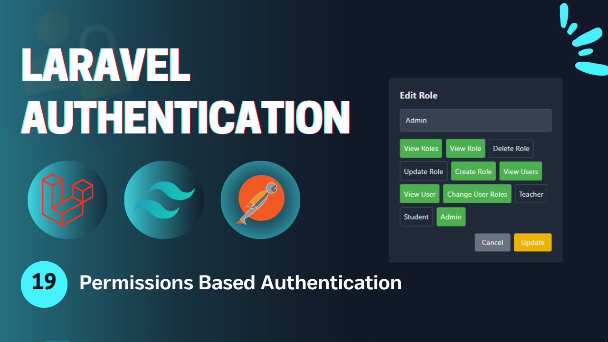
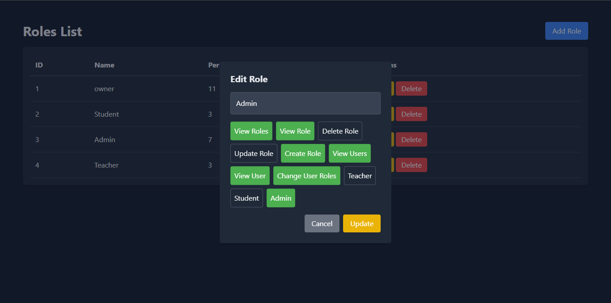

# Laravel Authentication - **Video 19: Permissions Based Authentication**
  

## Overview 🌟

In this video, we focus on applying the **Permissions Based Authentication** functionality for a Laravel application. 

The goal is to apply permissions authorization to the project using policies and middlewares.

🎥 **Watch the full video here:** [19: Permissions Based Authentication - Laravel Authentication](https://youtu.be/fR_aJ86xKmI)

---

## UI Design 🎨

Here are the designs related to the **Permissions Based Authentication**:

- **Roles Page**  
    
---

## Folder Structure 📁

Here is the folder structure for the relevant parts of the **Permissions Based Authentication** process:

```
📂 app
 ├── 📂 Http
 │    ├── 📂 Commands
 │    │     └── CreateAdminCommand.php
 │    ├── 📂 Enums
 │    │     └── PermissionsEnum.php
 │    ├── 📂 Controllers
 │    │    ├── Admin
 │    │    │    ├── RolesController.php
 │    │    │    └── UsersController.php
 │    │    └── Auth
 │    │         ├── LoginController.php
 │    │         ├── RegisterController.php
 │    │         ├── LogoutController.php
 │    │         ├── UpateProfileController.php
 │    │         ├── ChangePasswordController.php
 │    │         ├── ForgotPasswordController.php
 │    │         ├── ResetPasswordController.php
 │    │         ├── VerifyAccountController.php
 │    │         ├── MagicAuthController.php
 │    │         └── SocialAuthController.php
 │    ├── 📂 Middleware
 │    │    ├── RoleMiddleware.php
 │    │    └── PermissionMiddleware.php
 │    └── 📂 Requests
 │         ├── Admin
 │         │     ├── Roles
 |         │     │     ├── CreateRoleRequest.php
 │         │     │     └── UpdateRoleRequest.php
 │         │     └── Users
 │         │           └── ChangeUserRoleRequest.php
 │         └── Auth
 |              ├── LoginRequest.php
 │              ├── RegisterRequest.php
 │              ├── UpdateProfileRequest.php
 │              ├── ChangePasswordRequest.php
 │              ├── ForgotPasswordRequest.php
 │              ├── ResetPasswordRequest.php
 │              └── VerifyAccountRequest.php
 ├── 📂 Models
 │    ├── User.php
 │    ├── Role.php
 │    ├── Permission.php
 │    └── Session.php
 ├── 📂 Policies
 │    ├── RolePolicy.php
 │    └── UserPolicy.php
 ├── 📂 Mail
 │    ├── SendResetLinkMail.php
 │    ├── VerifyAccountMail.php
 │    └── SendMagicLinkMail.php
 ├── 📂 Services
 │    └── PhoneVerificationService.php
 └── 📂 Rules
      └── RecaptchaV3Rule.php
📂 resources
 └── 📂 views
      ├── 📂 admin
      |    ├── 📂 users
      │    │        └── index.blade.php
      |    └── 📂 roles
      │             └── index.blade.php
      ├── 📂 auth
      |    ├── login.blade.php
      │    ├── register.blade.php
      │    ├── forgot-password.blade.php
      │    ├── reset-password.blade.php
      │    ├── profile.blade.php
      │    ├── verify-email.blade.php
      │    └── passwordless-login.blade.php
      ├── 📂 pages
      │    ├── admin.blade.php
      │    ├── student.blade.php
      │    └── teacher.blade.php
      ├── 📂 emails
      │    ├── reset-password.blade.php
      │    ├── verify-account.blade.php
      │    └── passwordless-login.blade.php
      └── index.blade.php
📂 routes
 └── web.php
```

---

## Routes 🛤️

Below is the list of all relevant routes, including the **Email Verification** route:

| **HTTP Method** | **Route**                          | **Controller**              | **Auth**  | **Description**                          |
|-----------------|------------------------------------|-----------------------------|-----------|------------------------------------------|
| `GET`           | `/login`                           | -                           | Guest     | Display the login form.                  |
| `GET`           | `/register`                        | -                           | Guest     | Display the registration form.           |
| `POST`          | `/login`                           | `LoginController`           | Guest     | Handle login submissions.                |
| `POST`          | `/register`                        | `RegisterController`        | Guest     | Handle registration submissions.         |
| `GET`           | `/verify-account/{identifier}`     | -                           | Guest     | Display the email verification form.     |
| `POST`          | `/verify-account`                  | `VerifyAccountController`   | Guest     | Handle account verification.             |
| `POST`          | `/send-verification-otp`           | `VerifyAccountController`   | Guest     | Sending the verification request.        |
| `GET`           | `/forgot-password`                 | -                           | Guest     | Display the forgot password form.        |
| `GET`           | `/reset-password/{token}`          | -                           | Guest     | Display the reset password form.         |
| `POST`          | `/forgot-password`                 | `ForgotPasswordController`  | Guest     | Handle forgot password submission.       |
| `POST`          | `/reset-password`                  | `ResetPasswordController`   | Guest     | Handle password reset submission.        |
| `GET`           | `/auth/{driver}/redirect`          | `SocialAuthController`      | Guest     | Redirect to social service to login.     |
| `GET`           | `/auth/{driver}/callback`          | `SocialAuthController`      | Guest     | Callback from social to perform login.   |
| `GET`           | `/login/magic`                     | -                           | Guest     | Display the login without password page. |
| `POST`          | `/login/magic`                     | `MagicLoginController`      | Guest     | Send the mail in order to login.         |
| `GET`           | `/login/magic/{user}`              | `MagicLoginController`      | Guest     | Log the user in.                         |
| `POST`          | `/logout`                          | `LogoutController`          | Auth      | Log out the user.                        |
| `POST`          | `/logout/{session}`                | `LogoutController`          | Auth      | Log out the user's session.              |
| `GET`           | `/profile`                         | -                           | Auth      | Display the profile page (auth).         |
| `PUT`           | `/profile`                         | `UpdateProfileController`   | Auth      | Update the profile info (auth).          |
| `POST`          | `/change-password`                 | `ChangePasswordController`  | Auth      | Change the user password (auth).         |
| `GET`           | `/student`                         | -                           | Auth      | View the student page.                   |
| `GET`           | `/teacher`                         | -                           | Auth      | View the teacher page.                   |
| `GET`           | `/admin`                           | -                           | Auth      | View the admin page.                     |
| `GET`           | `/admin/users`                     | `UsersController`           | Auth      | View the users page.                     |
| `POST`          | `/admin/users/{user}/change-role`  | `UsersController`           | Auth      | Change the user role.                    |
| `GET`           | `/admin/roles`                     | `RolesController`           | Auth      | View the roels page.                     |
| `POST`          | `/admin/roles`                     | `RolesController`           | Auth      | Create a new role.                       |
| `PUT`           | `/admin/roles/{role}`              | `RolesController`           | Auth      | Update a role.                           |
| `DELETE`        | `/admin/roles/{role}`              | `RolesController`           | Auth      | Delete a role.                           |

---

## Implementation Details 🛠️

### **Enums** 📑

#### `PermissionsEnum`

The **PermissionsEnum** list all permissions used in the application as cases.

```php
enum PermissionsEnum: string{
  
  case VIEW_ROLES = 'view_roles';
  case VIEW_USERS = 'view_users';
  // ...

  public static function values(): array{
    return array_column(self::cases(), 'value');
  }
}
```
---

### **Middlewares** 📑

#### `PermissionMiddleware`

The **PermissionMiddleware** filters all requests and pass only the requests from an authenticated user and has the specified permission.

```php
class PermissionMiddleware{

  public function handle(Request $request, Closure $next, string $permission): Response{
    if(!Auth::user() || !Auth::user()->hasPermission($permission)) abort(403, 'Unauthorized action');
    return $next($request);
  }
}
```
---

### **Policies** 🛡

#### `RolePolicy`

The **RolePolicy** states all permissions related to the Role model.

```php
class RolePolicy{

  public function viewAny(User $user): bool{
    return $user->hasPermission(PermissionsEnum::VIEW_ROLES->value);
  }

  public function view(User $user, Role $role): bool{
    return $user->hasPermission(PermissionsEnum::VIEW_ROLE->value);
  }

  public function create(User $user): bool{
    return $user->hasPermission(PermissionsEnum::CREATE_ROLE->value);
  }

  public function update(User $user, Role $role): bool{
    return $user->hasPermission(PermissionsEnum::UPDATE_ROLE->value);
  }

  public function delete(User $user, Role $role): bool{
    return $user->hasPermission(PermissionsEnum::DELETE_ROLE->value);
  }
}
```
---

#### `UserPolicy`

The **UserPolicy** states all permissions related to the User model.

```php
class UserPolicy{

  public function viewAny(User $user): bool{
    return $user->hasPermission(PermissionsEnum::VIEW_USERS->value);
  }
}
```
---

### **Providers** 📑

#### `AppServiceProvider`

The **AppServiceProvider** boots if condition for blade system to check if the user has permission to show block of codes or not.

```php
class AppServiceProvider extends ServiceProvider{

  public function boot(): void{
    Blade::if('hasPermissionTo', function(string $permission){
      return Auth::user()->hasPermission($permission);
    });
  }
}
```
---

### **Models** 📑

#### `Permission`

The **Permission** model for the permissions table and the *BelongsToMany* relationship to the roles table.

```php
class Permission extends Model{
  
  protected $fillable = ['name'];

  public function roles(): BelongsToMany{
    return $this->belongsToMany(Role::class);
  }
}
```
---

#### `Role`

The **Role** model with *BelongsToMany* relationship to the permissions table.

```php
class Role extends Model{

  public function permissions(): BelongsToMany{
    return $this->belongsToMany(Permission::class);
  }
}
```
---

#### `User`

The **User** with the *BelongsToMany* relationship to the permissions table, and bool function to check permissions.

```php
class User extends Authenticatable{

  public function permissions(): array{
    return $this->roles()->with('permissions')->get()
      ->pluck('permissions')->flatten()->pluck('name')
      ->unique()->toArray();
  }

  public function hasPermission(string $permission): bool{
    return in_array($permission, $this->permissions());
  }
}
```
---


## Key Features ✨

- **Permissions Based Authentication Flow**: Deal with the permissions authorization using middleware and policies.  
- **Controller Design**: Modular controllers to handle the authentication process process.  
- **Flash Messages**: User feedback for successful or failed actions.  

---

## How to Use 🚀

1. Clone the repository:  
   ```bash
   git clone https://github.com/Abdogoda/Laravel-Authentication.git
   cd Laravel-Authentication/19_permissions_based_authentication
   ```

2. Install dependencies:  
   ```bash
   composer install
   ```

3. Set up configurations:  
   ```bash
   cp .env.example .env
   ```


4. Generate App Key
   ```bash
   php artisan key:generate
   ```

5. Set up the database (SQLITE):  
   ```bash
   php artisan migrate
   ```

6. Start the development server:  
   ```bash
   php artisan serve
   ```

7. Access the app in your browser at `http://localhost:8000`.

---

## Next Steps ▶️

In the next video, we'll expand this series's features by talking about api authentication in laravel.  
🎥 **Watch the full playlist here:** [Laravel Authentication](https://youtube.com/playlist?list=PLBy71Vfd0SzVaLjezaxqjnSsK8_p_aTcp&si=p3DluiMX7-euuw3A)