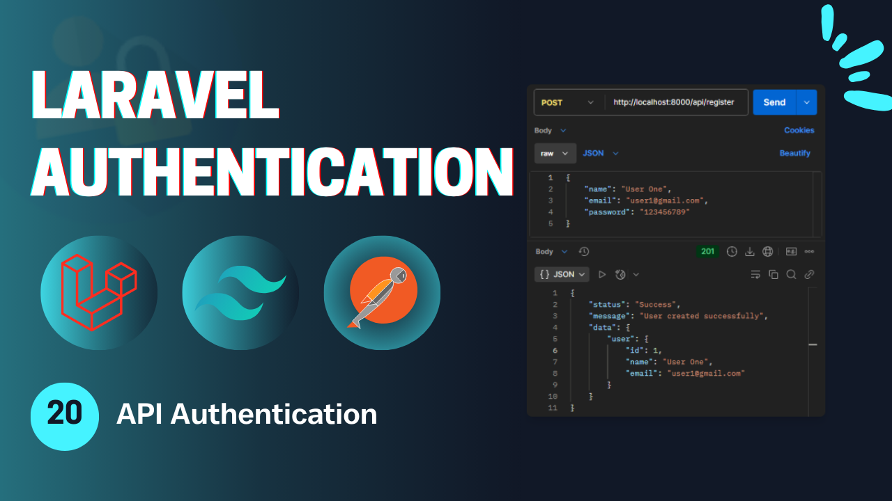
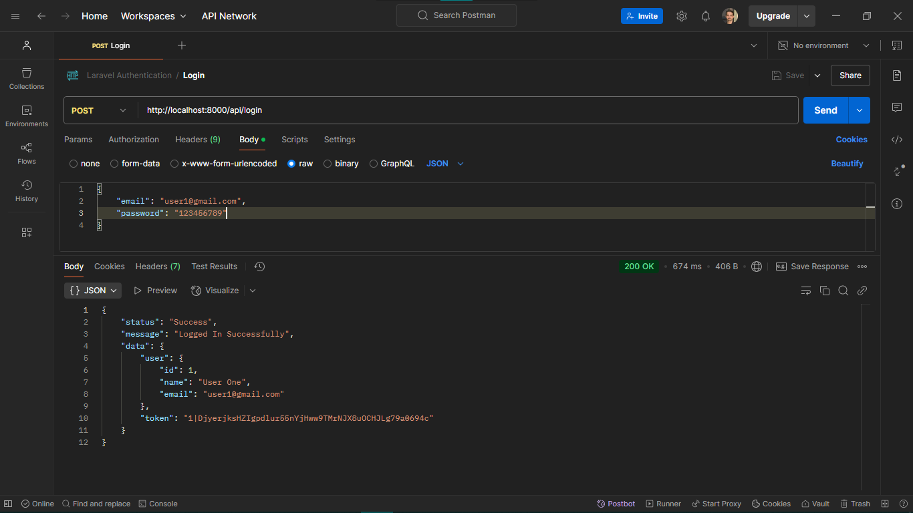
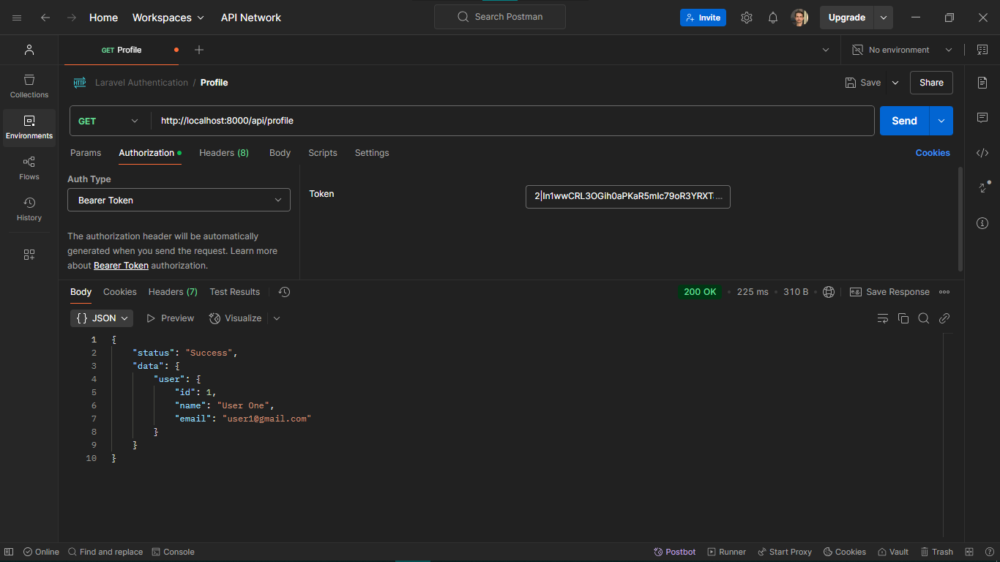
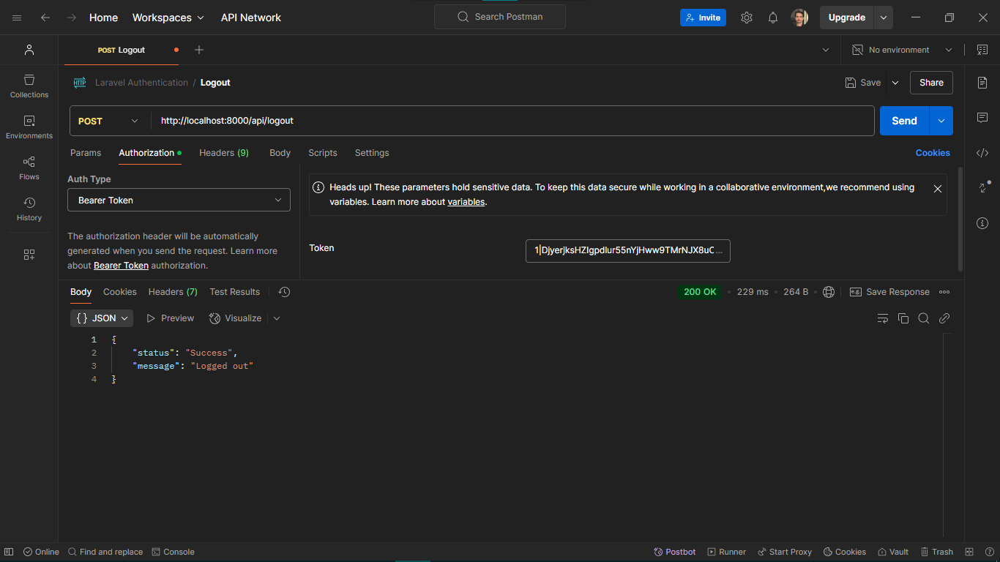

# Laravel Authentication - **Video 20: API Authentication** 🔒
  

## Overview 🌟

In this video, we implemented the foundational authentication features in api for a Laravel application, including:

- **Login** 🛠️  
- **Register** ✨  
- **Logout** 🔒  
- **Profile** 📑  
- Middleware-protected routes for api authenticated users (Profile, Logout).  

This video introduces essential Laravel authentication concepts in api and lays the groundwork for more advanced features in the playlist.  

🎥 **Watch the full video here:** [20: API Authentication - Laravel Authentication](https://youtu.be/rYwAMiI2c6M)  

---

## UI Design 🎨

Here are the designs for the **Login**, **Register**, **Profile**, and **Home** Requests:

1. **Login Request**  
     

2. **Register Request**  
     

3. **Profile Request**  
     

4. **Logout Request**  
     

---

## Folder Structure 📁

Below is the folder structure relevant to this video:

```
📂 app
 ├── 📂 Http
 │    ├── 📂 Controllers
 │    │    └── 📂Api
 │    │         └── 📂Auth
 │    │               └── AuthenticationController.php
 │    ├── 📂 Requests
 │    │    └── 📂Auth
 │    │         ├── LoginRequest.php
 │    │         └── RegisterRequest.php
 │    └── 📂 Resources
 │         └── UserResource.php
 ├── 📂 Models
 │    └── User.php
📂 resources
 └── 📂 views
      └── index.blade.php
📂 routes
 ├── web.php
 └── api.php
```

---

## Routes 🛤️

Here is a summary of the routes in the *api.php* used in this video:

| **HTTP Method** | **Route**       | **Controller**             | **Auth**  | **Description**                   |
|-----------------|-----------------|----------------------------|-----------|-----------------------------------|
| `GET`           | `/test`         | -                          | Guest     | Test the api configurations.      |
| `POST`          | `/login`        | `AuthenticationController` | Guest     | Handle login submissions.         |
| `POST`          | `/register`     | `AuthenticationController` | Guest     | Handle registration submissions.  |
| `POST`          | `/logout`       | `AuthenticationController` | Auth      | Log out the user.                 |
| `GET`           | `/profile`      | `AuthenticationController` | Auth      | Return the profile info.          |

---

## Implementation Details 🛠️

### **Controllers** 📄

#### `AuthenticationController`  
Handles user authentication functionalities and return api responses.

##### `Register Method`
Creates a new account and then return the user's data along with the success message.

```php
public function register(RegisterRequest $request){
  $user = User::create([
    'name' => $request->name,
    'email' => $request->email,
    'password' => Hash::make($request->password),
  ]);

  return response()->json([
    'status' => 'Success',
    'message' => 'User created successfully',
    'data' => [
      'user' => UserResource::make($user)
    ]
  ], 201);
}
```
---

##### `Login Method`
Login to the user's account by creating a token to be accessable and return it along with the success message.

```php
public function login(LoginRequest $request){

  $user = User::where('email', $request->email)->first();

  if(!$user || !Hash::check($request->password, $user->password)){
    return response()->json([
      'status' => 'Error',
      'message' => 'The Provided credentials are incorrect!'
    ], 401);
  }

  $token = $user->createToken('auth-token')->plainTextToken;
  return response()->json([
    'status' => 'Success',
    'message' => 'Logged In Successfully',
    'data' => [
      'user' => UserResource::make($user),
      'token' => $token
    ]
  ]);
}
```
---

##### `Profile Method`
Gets the user's account data from the *Auth::user()* method and return it as a user resource along with the success message.

```php
public function profile(){
  return response()->json([
    'status' => 'Success',
    'data' => [
      'user' => UserResource::make(Auth::user()),
    ]
  ]);
}
```
---

##### `Logout Method`
Log the authenticated user out by deleting its tokens.

```php
public function logout(Request $request){
  Auth::user()->tokens()->delete();

  return response()->json([
    'status' => 'Success',
    'message' => 'Logged out'
  ]);
}
```
---

## Key Features ✨

- **Route Structure**: Organized routes for login, register, and profile with middleware protection.  
- **Controller Design**: Clean and modular controller methods.  
- **Validation**: Centralized form validation using Laravel Request classes.  
- **Authentication**: User login and registration with session handling.  
- **Flash Messages**: User feedback for successful or failed actions.  

---

## How to Use 🚀

1. Clone the repository:  
   ```bash
   git clone https://github.com/Abdogoda/Laravel-Authentication.git
   cd Laravel-Authentication/20_api_authentication
   ```

2. Install dependencies:  
   ```bash
   composer install
   ```

3. Set up configurations:  
   ```bash
   cp .env.example .env
   ```

4. Generate App Key
   ```bash
   php artisan key:generate
   ```

5. Set up the database (SQLITE):  
   ```bash
   php artisan migrate
   ```

6. Start the development server:  
   ```bash
   php artisan serve
   ```

7. Access the app in your browser at `http://localhost:8000`.

---

## Next Steps ▶️

In the next video, we'll talk in details about the different between access and refresh tokens.  
🎥 **Watch the full playlist here:** [Laravel Authentication](https://youtube.com/playlist?list=PLBy71Vfd0SzVaLjezaxqjnSsK8_p_aTcp&si=p3DluiMX7-euuw3A)  
