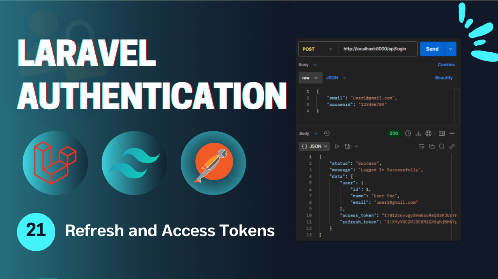
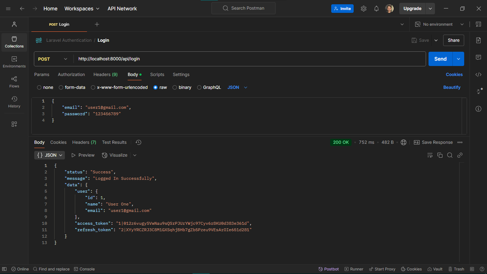
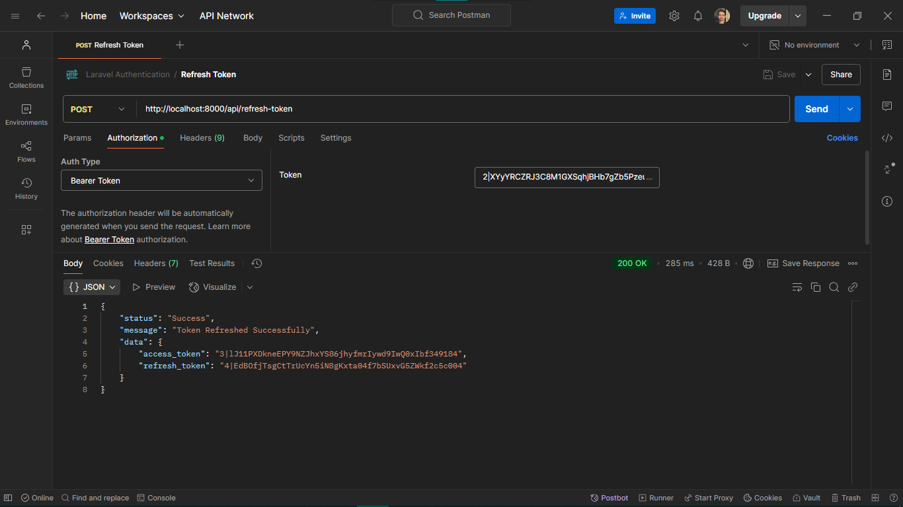

# Laravel Authentication - **Video 21: Refresh and Access Tokens** 🔒
  

## Overview 🌟

In this video, we explained the differences between refresh and access token and how to issue a new access token, and the use of abilities.

This video introduces essential Laravel authentication concepts in api and lays the groundwork for more advanced features in the playlist.  

🎥 **Watch the full video here:** [21: Refresh and Access Tokens - Laravel Authentication](https://youtu.be/rN2tHxAPSaY)  

---

## UI Design 🎨

Here are the designs for the **Login**, **Refresh Token** Requests:

1. **Login Request**  
     

2. **Refresh Token Request**  
     
---

## Folder Structure 📁

Below is the folder structure relevant to this video:

```
📂 app
 ├── 📂 Http
 │    ├── 📂 Controllers
 │    │    └── 📂Api
 │    │         └── 📂Auth
 │    │               └── AuthenticationController.php
 │    ├── 📂 Requests
 │    │    └── 📂Auth
 │    │         ├── LoginRequest.php
 │    │         └── RegisterRequest.php
 │    └── 📂 Resources
 │         └── UserResource.php
 ├── 📂 Models
 │    └── User.php
📂 resources
 └── 📂 views
      └── index.blade.php
📂 routes
 ├── web.php
 └── api.php
```

---

## Routes 🛤️

Here is a summary of the routes in the *api.php* used in this video:

| **HTTP Method** | **Route**        | **Controller**             | **Auth**  | **Description**                   |
|-----------------|------------------|----------------------------|-----------|-----------------------------------|
| `GET`           | `/test`          | -                          | Guest     | Test the api configurations.      |
| `POST`          | `/login`         | `AuthenticationController` | Guest     | Handle login submissions.         |
| `POST`          | `/register`      | `AuthenticationController` | Guest     | Handle registration submissions.  |
| `POST`          | `/logout`        | `AuthenticationController` | Auth      | Log out the user.                 |
| `GET`           | `/profile`       | `AuthenticationController` | Auth      | Retuen the profile info.          |
| `POST`          | `/refresh-token` | `AuthenticationController` | Auth      | Issue a new access token.         |

---

## Implementation Details 🛠️

### **Controllers** 📄

#### `AuthenticationController`  
Handles user authentication functionalities and return api responses.

##### `Login Method`
Login to the user's account by creating two tokens (access, and refresh) to be accessable and return it along with the success message.

```php
public function login(LoginRequest $request){

  $user = User::where('email', $request->email)->first();

  if(!$user || !Hash::check($request->password, $user->password)){
    return response()->json([
      'status' => 'Error',
      'message' => 'The Provided credentials are incorrect!'
    ], 401);
  }

  $access_token = $user->createToken('access-token', [TokenAbility::ACCESS_API->value], Carbon::now()->addMinutes(config('sanctum.access_token_expiration')))->plainTextToken;
  $refresh_token = $user->createToken('refresh-token', [TokenAbility::ISSUE_ACCESS_TOKEN->value], Carbon::now()->addMinutes(config('sanctum.refresh_token_expiration')))->plainTextToken;
  
  return response()->json([
    'status' => 'Success',
    'message' => 'Logged In Successfully',
    'data' => [
      'user' => UserResource::make($user),
      'access_token' => $access_token,
      'refresh_token' => $refresh_token
    ]
  ]);
}
```
---

##### `Refresh Token Method`
Issue a new access token and return it along with the success message.

```php
public function refreshToken(Request $reqeust){
  $user = Auth::user();

  $user->currentAccessToken()->delete();
  $access_token = $user->createToken('access-token', [TokenAbility::ACCESS_API->value], Carbon::now()->addMinutes(config('sanctum.access_token_expiration')))->plainTextToken;
  $refresh_token = $user->createToken('refresh-token', [TokenAbility::ISSUE_ACCESS_TOKEN->value], Carbon::now()->addMinutes(config('sanctum.refresh_token_expiration')))->plainTextToken;
  
  return response()->json([
    'status' => 'Success',
    'message' => 'Token Refreshed Successfully',
    'data' => [
      'access_token' => $access_token,
      'refresh_token' => $refresh_token
    ]
  ]);
}
```
---

### **Enums** 📃
#### `TokenAbility`
Store all token abilities used in the application.

```php
enum TokenAbility: string{
  case ACCESS_API = 'access_api';
  case ISSUE_ACCESS_TOKEN = 'issue_access_token';
}
```
---

## Key Features ✨

- **Route Structure**: Organized routes for login, refresh token with middleware protection.  
- **Controller Design**: Clean and modular controller methods.  
- **Validation**: Centralized form validation using Laravel Request classes.  
- **Authentication**: User login and registration with session handling.  
- **Flash Messages**: User feedback for successful or failed actions.  

---

## How to Use 🚀

1. Clone the repository:  
   ```bash
   git clone https://github.com/Abdogoda/Laravel-Authentication.git
   cd Laravel-Authentication/22_refresh_and_access_tokens
   ```

2. Install dependencies:  
   ```bash
   composer install
   ```

3. Set up configurations:  
   ```bash
   cp .env.example .env
   ```

4. Generate App Key
   ```bash
   php artisan key:generate
   ```

5. Set up the database (SQLITE):  
   ```bash
   php artisan migrate
   ```

6. Start the development server:  
   ```bash
   php artisan serve
   ```

7. Access the app in your browser at `http://localhost:8000`.

---

## Next Steps ▶️

🔥 Thank You for Watching the Laravel Authentication Series! 🔥

🎉 That’s a wrap! We’ve covered everything from basic authentication to API authentication, securing routes, and more. I hope this series has helped you level up your Laravel skills! 🚀

💬 Have questions or feedback? Let me know in the comments!
🎥 **Watch the full playlist here:** [Laravel Authentication](https://youtube.com/playlist?list=PLBy71Vfd0SzVaLjezaxqjnSsK8_p_aTcp&si=p3DluiMX7-euuw3A)  
